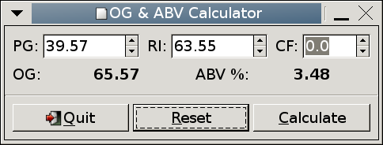

.. _sec-cxxglade:

GTK+ and C++
============

Introduction
------------

In the previous section, it was shown that Glade and GObject could
make programs much simpler, and hence increase their long-term
maintainability.  However, some problems remain:

* Much type checking is done at run-time.  This might mean errors
  only show up when the code is in production use.
* Although object-oriented, using objects in C is a bit clunky.
  In addition, it is very difficult (although not impossible) to
  derive new widgets from existing ones using GObject, or override a
  class method or signal.  Most programmers do not bother, or just use
  "compound widgets", which are just a container containing more
  widgets.
* Signal handlers are not type safe.  This could result in
  undefined behaviour, or a crash, if a signal handler does not have a
  signature compatible with the signal it is connected to.
* Signal handlers are functions, and there is often a need to
  resort to using global variables and casting structures to type
  :c:type:`gpointer` to pass complex information to a callback though its
  :c:data:`data` argument.  If Glade or GObject are used, this can be
  avoided, however.

Gtkmm offers solutions to most of these problems.  Firstly, all of the
GTK+ objects are available as native C++ classes.  The object accessor
functions are now normal C++ *class methods*, which prevents some
of the abuse of objects that could be accomplished in C.  The
advantage is less typing, and there is no need to manually cast
between an object's types to use the methods for different classes in
the inheritance hierarchy.

The Gtkmm classes may be used just like any other C++ class, and this
includes deriving new objects from them through inheritance.  This
also enables all the type checking to be performed by the compiler,
which results in more robust code, since object type checking is not
deferred until run-time.

Signal handling is also more reliable.  Gtkmm uses the
:program:`libsigc++` library, which provides a templated signalling
mechanism for type-safe signal handling.  The :cpp:class:`mem_fun` objects
allow signal handlers with a different signature than the signal
requires to be bound, which gives greater flexibility than the C
signals allow.  Perhaps the most notable feature is that signal
handlers may be class methods, which are recommended over global
functions.  This results in further encapsulation of complexity, and
allows the signal handlers to access the member data of their class.
Unlike the *Qt* library, Gtkmm does not require any source
preprocessing, allowing plain ISO C++ to be used without extensions.

:program:`libglademm` is a C++ wrapper around libglade, and may be used
to dynamically load user interfaces as in the previous section.  It
provides similar functionality, the exception being that signals must
be connected manually.  This is because the :program:`libsigc++`
signals, connecting to the methods of individual objects, cannot be
connected automatically.

:program:`gtk/C++/glade/ogcalc`, shown in Figure :ref:`fig:ogcalcmm`, is
identical to the previous examples, both in appearance and
functionality.  However, internally there are some major differences.

.. _fig-ogcalcmm:

   :program:`gtk/C++/glade/ogcalc` in action

Firstly, the :cpp:func:`main` function no longer knows anything about
the user interface.  It merely instantiates an instance of the
:cpp:class:`ogcalc` class, similarly to :program:`gtk/C/gobject/ogcalc`.

The :cpp:class:`ogcalc` class is derived from the :cpp:class:`Gtk::Window`
class, and so contains all of the functionality of a
:cpp:class:`Gtk::Window`, plus its own additional functions and data.
:cpp:class:`ogcalc` contains methods called
:cpp:func:`on_button_clicked_calculate` and
:cpp:func:`on_button_clicked_reset`.  These are the equivalents of
the functions :c:func:`on_button_clicked_calculate` and
:c:func:`on_button_clicked_reset` used in the previous examples.
Because these functions are class methods, they have access to the
class member data, and as a result are somewhat simpler than
previously.

Two versions are provided, one using the basic C++ classes and methods
to construct the interface, the other using :program:`libglademm` to
load and construct the interface as for the previous examples using
Glade.  Only the latter is discussed here.  There are a great many
similarities between the C and C++ versions not using Glade, and the C
Gobject version and the C++ Glade version.  It is left as an exercise
to the reader to compare and contrast them.

Code Listing
------------

:file:`gtk/C++/glade/ogcalc.h`

.. literalinclude:: ../gtk/C++/glade/ogcalc.h
   :language: c++
   :lines: 27-54

:file:`gtk/C++/glade/ogcalc.cc`

.. literalinclude:: ../gtk/C++/glade/ogcalc.cc
   :language: c++
   :lines: 24-128

:file:`gtk/C++/glade/ogcalc-main.cc`

.. literalinclude:: ../gtk/C++/glade/ogcalc-main.cc
   :language: c++
   :lines: 24-40

To build the source, do the following:

::

   cd gtk/C++/glade
   c++ $(pkg-config --cflags libglademm-2.4) -c ogcalc.cc
   c++ $(pkg-config --cflags libglademm-2.4) -c ogcalc-main.cc
   c++ $(pkg-config --libs libglademm-2.4) -o ogcalc ogcalc.o \
                                             ogcalc-main.o

Similarly, for the plain C++ version, which is not discussed in the
tutorial:

::

   cd gtk/C++/plain
   c++ $(pkg-config --cflags gtkmm-2.4) -c ogcalc.cc
   c++ $(pkg-config --cflags gtkmm-2.4) -c ogcalc-main.cc
   c++ $(pkg-config --libs gtkmm-2.4) -o ogcalc ogcalc.o \
                                               ogcalc-main.o

Analysis
--------

:file:`ogcalc.h`
^^^^^^^^^^^^^^^^

The header file declares the :cpp:class:`ogcalc` class.

.. code-block:: c++

   class ogcalc : public Gtk::Window

:cpp:class:`ogcalc` is derived from :cpp:class:`Gtk::Window`

.. code-block:: c++

   virtual void on_button_clicked_calculate();
   virtual void on_button_clicked_reset();

:cpp:func:`on_button_clicked_calculate` and
:cpp:func:`on_button_clicked_reset` are the signal handling
functions, as previously.  However, they are now class *member
functions*, taking no arguments.

.. code-block:: c++

   Gtk::SpinButton* pg_entry;
   Glib::RefPtr<Gnome::Glade::Xml> xml_interface;

The class data members include pointers to the objects needed by the
callbacks (which can access the class members like normal class member
functions).  Note that :cpp:class:`Gtk::SpinButton` is a native C++ class.
It also includes a pointer to the XML interface description.
:cpp:class:`Glib::RefPtr` is a templated, reference-counted, "smart
pointer" class, which will take care of destroying the pointed-to
object when :cpp:class:`ogcalc` is destroyed.

:file:`ogcalc.cc`
^^^^^^^^^^^^^^^^^^^^

The constructor :cpp:func:`ogcalc::ogcalc` takes care of creating the
interface when the class is instantiated.

.. code-block:: c++

   set_title("OG & ABV Calculator");
   set_resizable(false);

The above code uses member functions of the :cpp:class:`Gtk::Window` class.
The global functions :c:func:`gtk_window_set_title` and
:c:func:`gtk_window_set_resizable` were used previously.

.. code-block:: c++

   set_title("OG & ABV Calculator");
   set_resizable(false);

   xml_interface =
     Gnome::Glade::Xml::create("ogcalc.glade",
                               "ogcalc_main_vbox");
   Gtk::VBox *main_vbox;
   xml_interface->get_widget("ogcalc_main_vbox", main_vbox);
   add(*main_vbox);

The Glade interface is loaded using
:cpp:func:`Gnome::Glade::Xml::create`, in a similar manner to the
GObject example, and then the main VBox is added to the :cpp:class:`Ogcalc`
object.

.. code-block:: c++

   xml_interface->get_widget("pg_entry", pg_entry);

Individual widgets may be obtained from the widget tree using the
static member function :cpp:func:`Gnome::Glade::Xml::get_widget`.

Because Gtkmm uses :program:`libsigc++` for signal handling, which uses
class member functions as signal handlers (normal functions may also
be used, too), the signals cannot be connected automatically, as in
the previous example.

.. code-block:: c++

   quit_button->signal_clicked().connect
     ( sigc::mem_fun(*this, &ogcalc::hide) );

This complex-looking code can be broken into several parts.

.. code-block:: c++

   sigc::mem_fun(*this, &ogcalc::hide)

creates a :cpp:class:`sigc::mem_fun` (function object) which points
to the :cpp:func:`ogcalc::hide` member function of this object.

.. code-block:: c++

   quit_button->signal_clicked()

returns a :cpp:class:`Glib::SignalProxy0` object (a signal taking no
arguments).  The :cpp:func:`connect` method of the signal proxy is used
to connect :cpp:func:`ogcalc::hide` to the "clicked" signal of the
:cpp:class:`Gtk::Button`.

.. code-block:: c++

   calculate_button->signal_clicked().connect
     ( sigc::mem_fun(*this,
                    &ogcalc::on_button_clicked_calculate) );
   calculate_button->signal_clicked().connect
     ( sigc::mem_fun(*reset_button, &Gtk::Widget::grab_focus) );

Here two signal handlers are connected to the same signal.  When the
"Calculate" button is clicked,
:cpp:func:`ogcalc::on_button_clicked_calculate` is called first,
followed by :cpp:func:`Gtk::Widget::grab_focus`.

.. code-block:: c++

   cf_entry->signal_activate().connect
     ( sigc::hide_return
       ( sigc::mem_fun(*this,
                      &Gtk::Window::activate_default) ) );

:cpp:class:`sigc::hide_return` is a special :cpp:class:`sigc::mem_fun` used to
mask the boolean value returned by :cpp:func:`activate_default`.  The
:cpp:class:`mem_fun` created is incompatible with with the
:cpp:class:`mem_fun` type required by the signal, and this "glues" them
together.

In the :cpp:func:`ogcalc::on_button_clicked_calculate` member
function,

.. code-block:: c++

   double pg
   pg = pg_entry->get_value();

the member function :cpp:func:`Gtk::SpinButton::get_value`
was previously used as :cpp:func:`gtk_spin_button_get_value`.

.. code-block:: c++

   std::ostringstream output;
   output.imbue(std::locale(""));
   output << "<b>" << std::fixed << std::setprecision(2)
          << og << "</b>";
   og_result->set_markup(Glib::locale_to_utf8(output.str()));

This code sets the result field text, using an output stringstream and
Pango markup.

In the :cpp:func:`ogcalc::on_button_clicked_reset` member function,

.. code-block:: c++

   pg_entry->set_value(0.0);
   og_result->set_text("");
   pg_entry->grab_focus();

class member functions are used to reset and clear the
widgets as in previous examples.

:file:`ogcalc-main.cc`
^^^^^^^^^^^^^^^^^^^^^^

This file contains a very simple :cpp:func:`main` function.

.. code-block:: c++

   Gtk::Main kit(argc, argv); // Initialise GTK+.
   ogcalc window;
   kit.run(window);

A :cpp:class:`Gtk::Main` object is created, and then an :cpp:class:`ogcalc`
class, :cpp:member:`window`, is instantiated.  Finally, the interface is
run, using ``kit.run()``.  This function will return when
:cpp:member:`window` is hidden, and then the program will exit.
