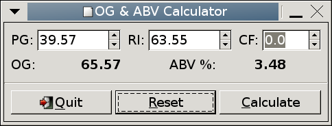
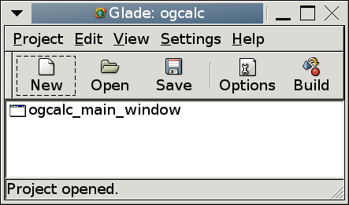
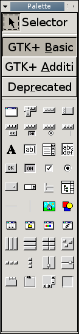
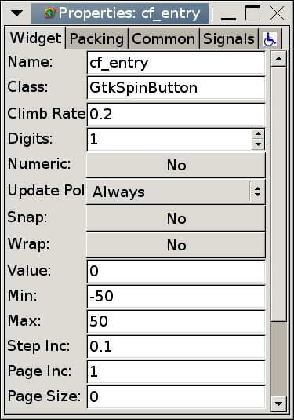
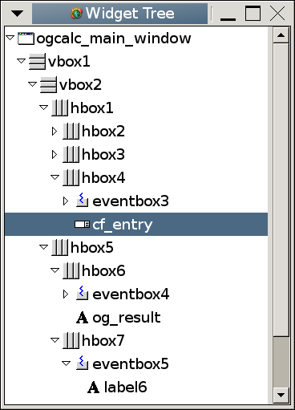
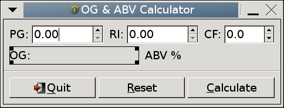

.. _sec-gtkc:

GTK+ and C
==========

Introduction
------------

Many GTK+ applications are written in C alone.  This section
demonstrates the :program:`gtk/C/plain/ogcalc` program discussed in the
previous section.  Figure :ref:`fig-ogcalc` is a screenshot of the
finished application.

.. _fig-ogcalc:

   :program:`gtk/C/plain/ogcalc` in action

This program consists of five functions:

:c:func:`on_button_clicked_reset`
   Reset the interface to its default state.
:c:func:`on_button_clicked_calculate`
   Get the values the user has entered, do
   a calculation, then display the results.
:c:func:`main`
   Initialise GTK+, construct the interface,
   connect the signal handlers, then enter the GTK+ event loop.
:c:func:`create_spin_entry`
   A helper function to create a
   numeric entry with descriptive label and tooltip, used when
   constructing the interface.
:c:func:`create_result_label`
   A helper function to create a
   result label with discriptive label and tooltip, used when
   constructing the interface.

Code listing
------------

The program code is listed below.  The source code is extensively
commented, to explain what is going on.

:download:`gtk/C/plain/ogcalc.c <../gtk/C/plain/ogcalc.c>`

Structure to hold the interface state.

.. literalinclude:: ../gtk/C/plain/ogcalc.c
   :language: c
   :start-after: BEGIN CALCULATION_WIDGETS
   :end-before: END CALCULATION_WIDGETS
   :linenos:

:c:func:`main` function.

.. literalinclude:: ../gtk/C/plain/ogcalc.c
   :language: c
   :start-after: BEGIN MAIN
   :end-before: END MAIN
   :linenos:

Create a numeric entry with descriptive label.

.. literalinclude:: ../gtk/C/plain/ogcalc.c
   :language: c
   :start-after: BEGIN CREATE_SPIN_ENTRY
   :end-before: END CREATE_SPIN_ENTRY
   :linenos:

Create a result label with descriptive label.

.. literalinclude:: ../gtk/C/plain/ogcalc.c
   :language: c
   :start-after: BEGIN CREATE_RESULT_LABEL
   :end-before: END CREATE_RESULT_LABEL
   :linenos:

Signal handler to reset the interface.

.. literalinclude:: ../gtk/C/plain/ogcalc.c
   :language: c
   :start-after: BEGIN ON_BUTTON_CLICKED_RESET
   :end-before: END ON_BUTTON_CLICKED_RESET
   :linenos:

Signal handler to calculate and display the results.

.. literalinclude:: ../gtk/C/plain/ogcalc.c
   :language: c
   :start-after: BEGIN ON_BUTTON_CLICKED_CALCULATE
   :end-before: END ON_BUTTON_CLICKED_CALCULATE
   :linenos:

Building
--------

To build the source, do the following:

::

   cd gtk/C/plain
   cc $(pkg-config --cflags gtk+-2.0) -c ogcalc.c
   cc $(pkg-config --libs gtk+-2.0) -o ogcalc ogcalc.o

Analysis
--------

The :c:func:`main` function is responsible for constructing the user
interface, connecting the signals to the signal handlers, and then
entering the main event loop.  The more complex aspects of the
function are discussed here.

.. code-block:: c

   g_signal_connect (G_OBJECT(window),
                     "destroy",
                     gtk_main_quit, NULL);

This code connects the "destroy" signal of :c:data:`window` to the
:c:func:`gtk_main_quit` function.  This signal is emitted by the
window when it is to be destroyed, for example when the "close"
button on the titlebar is clicked).  The result is that when the
window is closed, the main event loop returns, and the program then
exits.

.. code-block:: c

   vbox1 = gtk_vbox_new (FALSE, 0);
   gtk_container_add (GTK_CONTAINER(window), vbox1);

:c:data:`vbox1` is a :c:type:`GtkVBox`.  When constructed using
:c:func:`gtk_vbox_new` , it is set to be non-homogeneous (``FALSE``),
which allows the widgets contained within the :c:type:`GtkVBox` to be
of different sizes, and has zero pixels padding space between the
container widgets it will contain.  The homogeneity and padding space
are different for the various :c:type:`GtkBox` widgets used, depending
on the visual effect intended.

:c:func:`gtk_container_add` packs :c:data:`vbox1` into the window
(a :c:type:`GtkWindow` object *is a* :c:type:`GtkContainer`).

.. code-block:: c

   eventbox = gtk_event_box_new();
   gtk_widget_show(eventbox);
   gtk_box_pack_start (GTK_BOX(hbox2), eventbox,
                       FALSE, FALSE, 0);

Some widgets do not receive events from the windowing system, and
hence cannot emit signals.  Label widgets are one example of this.  If
this is required, for example in order to show a tooltip, they must be
put into a :c:type:`GtkEventBox`, which can receive the events.  The
signals emitted from the :c:type:`GtkEventBox` may then be connected to
the appropriate handler.

:c:func:`gtk_widget_show` displays a widget.  Widgets are hidden by
default when created, and so must be shown before they can be used.
It is typical to show the top-level window *last*, so that the
user does not see the interface being drawn.

:c:func:`gtk_box_pack_start` packs a widget into a :c:type:`GtkBox`,
in a similar manner to :c:func:`gtk_container_add`.  This packs
:c:data:`eventbox` into :c:data:`hbox2`.  The last three arguments
control whether the child widget should expand into an extra space
available, whether it should fill any extra space available (this has
no effect if :c:data:`expand` is ``FALSE``), and extra space in
pixels to put between its neighbours (or the edge of the box),
respectively.  Figure :ref:`fig-boxpacking` shows how
:c:func:`gtk_box_pack_start` works.

.. _fig-boxpacking:
.. figure:: figures/box-packing.*
   :figwidth: 100%
   :width: 40%
   :align: center

   Packing widgets into a :c:type:`GtkHBox`.

The :c:func:`create_spin_entry` function is a helper function to
create a numeric entry (spin button) together with a label and
tooltip.  It is used to create all three entries.

.. code-block:: c

   label = gtk_label_new(label_text);

A new label is created displaying the text :c:data:`label_text`.

.. code-block:: c

   spinbutton = gtk_spin_button_new (adjustment, 0.5, 2);
   gtk_spin_button_set_numeric
     (GTK_SPIN_BUTTON(spinbutton), TRUE);

A :c:type:`GtkSpinButton` is a numeric entry field.  It has up and
down buttons to "spin" the numeric value up and down.  It is
associated with a :c:type:`GtkAdjustment`, which controls the range
allowed, default value, etc..  :c:func:`gtk_adjustment_new` returns a
new :c:type:`GtkAdjustment` object.  Its arguments are the default
value, minimum value, maximum value, step increment, page increment
and page size, respectively.  This is straightforward, apart from the
step and page increments and sizes.  The step and page increments are
the value that will be added or subtracted when the mouse button 1 or
button 2 are clicked on the up or down buttons, respectively.  The
page size has no meaning in this context (:c:type:`GtkAdjustment` is
also used with scrollbars).

:c:func:`gtk_spin_button_new` creates a new :c:type:`GtkSpinButton`,
and associates it with :c:data:`adjustment`.  The second and third
arguments set the "climb rate" (rate of change when the spin buttons
are pressed) and the number of decimal places to display.

Finally, :c:func:`gtk_spin_button_set_numeric` is used to ensure
that only numbers can be entered.

.. code-block:: c

   tooltip = gtk_tooltips_new();
   gtk_tooltips_set_tip(tooltip, eventbox,
                        tooltip_text, NULL);

A tooltip (pop-up help message) is created with
:c:func:`gtk_tooltips_new`.  :c:func:`gtk_tooltips_set_tip` is
used to associate :c:data:`tooltip` with the :c:data:`eventbox`
widget, also specifying the message it should contain.  The fourth
argument should typically be ``NULL``.

The :c:func:`create_result_label` function is a helper function to
create a result label together with a descriptive label and tooltip.

.. code-block:: c

   gtk_label_set_selectable (GTK_LABEL(result_value), TRUE);

Normally, labels simply display a text string.  The above code allows
the text to be selected and copied, to allow pasting of the text
elsewhere.  This is used for the result fields so the user can easily
copy them.

Continuing with the :c:func:`main` function:

.. code-block:: c

   button1 = gtk_button_new_from_stock(GTK_STOCK_QUIT);

This code creates a new button, using a *stock widget*.  A stock
widget contains a predefined icon and text.  These are available for
commonly used functions, such as "OK", "Cancel", "Print", etc..

.. code-block:: c

   button2 = gtk_button_new_with_mnemonic("_Calculate");
   g_signal_connect (G_OBJECT (button2), "clicked",
                     G_CALLBACK(on_button_clicked_calculate),
                     (gpointer) &cb_widgets);
   GTK_WIDGET_SET_FLAGS (button2, GTK_CAN_DEFAULT);

Here, a button is created, with the label "Calculate".  The
*mnemonic* is the ``_C``, which creates an *accelerator*.  This
means that when Alt-C is pressed, the button is activated (i.e. it is
a keyboard shortcut).  The shortcut is underlined, in common with
other graphical toolkits.

The "clicked" signal (emitted when the button is pressed and
released) is connected to the :c:func:`on_button_clicked_calculate`
callback.  A pointer to the :c:data:`cb_widgets` structure is passed
as the argument to the callback.

Lastly, the ``GTK_CAN_DEFAULT`` attribute is set.  This attribute
allows the button to be the default widget in the window.

.. code-block:: c

   g_signal_connect_swapped
     (G_OBJECT (cb_widgets.pg_val),
      "activate",
      G_CALLBACK (gtk_widget_grab_focus),
      (gpointer)GTK_WIDGET(cb_widgets.ri_val));

This code connects signals in the same way as
:c:func:`gtk_signal_connect`.  The difference is the fourth
argument, which is a :c:type:`GtkWidget` pointer.  This allows the
signal emitted by one widget to be received by the signal handler for
another.  Basically, the :c:data:`widget` argument of the signal
handler is given :c:data:`cb_widgets.ri_val` rather than
:c:data:`cb_widgets.pg_val`.  This allows the focus (where keyboard
input is sent) to be switched to the next entry field when Enter is
pressed in the first.

.. code-block:: c

   g_signal_connect_swapped
     (G_OBJECT (cb_widgets.cf_val),
      "activate",
      G_CALLBACK (gtk_window_activate_default),
      (gpointer) GTK_WIDGET(window));

This is identical to the last example, but in this case the callback
is the function :c:func:`gtk_window_activate_default` and the widget
to give to the signal handler is :c:data:`window`.  When Enter is
pressed in the CF entry field, the default "Calculate" button is
activated.

.. code-block:: c

   gtk_main();

This is the GTK+ event loop.  It runs until :c:func:`gtk_main_quit`
is called.

The signal handlers are far simpler than the interface construction.
The function :c:func:`on_button_clicked_calculate` reads the user
input, performs a calculation, and then displays the result.

.. code-block:: c

   void on_button_clicked_calculate( GtkWidget *widget,
                                     gpointer   data )
   {
     struct calculation_widgets *w;
     w = (struct calculation_widgets *) data;

Recall that a pointer to :c:data:`cb_widgets`, of type :c:type:`struct
calculation_widgets`, was passed to the signal handler, cast to a
:c:type:`gpointer`.  The reverse process is now applied, casting
:c:data:`data` to a pointer of type :c:type:`struct calculation_widgets`.
This is one of the major flaws with GTK+; casting to and from raw
pointers completely defeats compile-time type checking and can lead to
crashes and/or undefined behaviour if the wrong type is passed.

.. code-block:: c

   gdouble pg;
   pg = gtk_spin_button_get_value
     (GTK_SPIN_BUTTON(w->pg_val));

This code gets the value from the :c:type:`GtkSpinButton`.

.. code-block:: c

   gchar *og_string;
   og_string = g_strdup_printf ("<b>%0.2f</b>", og);
   gtk_label_set_markup (GTK_LABEL(w->og_result),
                         og_string);
   g_free (og_string);

Here the result :c:data:`og` is printed to the string
:c:data:`og_string`.  This is then set as the label text using
:c:func:`gtk_label_set_markup`.  This function sets the label text
using the *Pango Markup Format*, which uses the ``<b>`` and
``</b>`` tags to embolden the text.

.. code-block:: c

   gtk_spin_button_set_value (GTK_SPIN_BUTTON(w->pg_val),
                              0.0);
   gtk_label_set_text (GTK_LABEL(w->og_result), "");

:c:func:`on_button_clicked_reset` resets the input fields to their
default value, and blanks the result fields.

.. _sec-glade:

GTK+ and Glade
==============

Introduction
------------

In the previous section, the user interface was constructed entirely
"by hand".  This might seem to be rather difficult to do, as well as
being messy and time-consuming.  In addition, it also makes for rather
unmaintainable code, since changing the interface, for example to add
a new feature, would be rather hard.  As interfaces become more
complex, constructing them entirely in code becomes less feasible.

The Glade user interface designer is an alternative to this.  Glade
allows one to design an interface visually, selecting the desired
widgets from a palette and placing them on windows, or in containers,
in a similar manner to other interface designers.  The figures in this
section show some of the interface features of the designer.

.. _fig-glade:

The Glade user interface designer.

.. _fig-glade:main:

   Main window

.. _fig-glade:palette:

   Palette for widget selection

.. _fig-glade:properties:

   Widget properties dialogue

.. _fig-glade:tree:

   Widget tree

.. _fig-glade:ogcalc:

   The program being designed

There are two ways to load Glade interfaces.  The current method is
built in to GTK+, using the :c:type:`GtkBuilder` class to load the
interface.  These interface files end with a :file:`.ui` extension.
The older method is to use the :program:`glade` library which is
separate from the main GTK+ libraries.  These interface files use a
:file:`.glade` extension.  Either method may be used, though the newer
:c:type:`GtkBuilder` method would be the better choice for new code.
The interfaces are mostly identical, since :c:type:`GtkBuilder` is
essentially the incorporation of :program:`glade` into GTK+.  Examples
using both methods are provided.

The files :file:`gtk/C/builder/ogcalc.ui` and
:file:`gtk/C/glade/ogcalc.glade` contain the same interface
constructed in :program:`gtk/C/plain/ogcalc`, but designed in Glade.
These files can be opened in Glade, and changed as needed, without
needing to touch any code.  Even signal connection is automated.
Examine the "Signals" tab in the "Properties" dialogue box.

The source code is listed below.  This is the same as the previous
listing, but with the following changes:

* The :c:func:`main` function does not construct the interface.  It
  merely loads the :file:`ogcalc.glade` interface description,
  auto-connects the signals, and shows the main window.
* The :c:type:`cb_widgets` structure is no longer needed: the callbacks
  are now able to query the widget tree through the Glade XML object
  to locate the widgets they need.  This allows for greater
  encapsulation of data, and signal handler connection is simpler.
* The code saving is significant, and there is now separation between
  the interface and the callbacks.

The running :program:`gtk/C/glade/ogcalc` application is shown in Figure
:ref:`fig-ogcalcgl`.  Notice that it is identical to
:program:`gtk/C/plain/ogcalc`, shown in Figure :ref:`fig-ogcalc`.  (No, they
are *not* the same screenshot!)

.. _fig-ogcalcgl:
.. figure:: figures/c-glade.png
   :figwidth: 60%
   :align: center

   :program:`gtk/C/glade/ogcalc` in action

Code listing
------------

* :download:`gtk/C/builder/ogcalc.c <../gtk/C/builder/ogcalc.c>`
* :download:`gtk/C/glade/ogcalc.c <../gtk/C/glade/ogcalc.c>`

To build the source, do the following:

::

   cd gtk/C/glade
   cc $(pkg-config --cflags libglade-2.0 gmodule-2.0) -c ogcalc.c
   cc $(pkg-config --libs libglade-2.0 gmodule-2.0)
     -o ogcalc ogcalc.o

Analysis
--------

The most obvious difference between this listing and the previous one
is the huge reduction in size.  The :c:func:`main` function is
reduced to just these lines for :c:type:`GtkBuilder`:

.. code-block:: c

   GtkBuilder *builder;
   GtkWidget *window;
   GError *error = NULL;

   builder = gtk_builder_new();
   if (!gtk_builder_add_from_file(builder, "ogcalc.ui", &error))
     { /* Handle error here. */ }

   gtk_builder_connect_signals(builder, (gpointer) builder);

   window = GTK_WIDGET(gtk_builder_get_object(builder, "ogcalc_main_window"));
   gtk_widget_show(window);

and for :program:`glade`

.. code-block:: c

   GladeXML *xml;
   GtkWidget *window;

   xml = glade_xml_new("ogcalc.glade", NULL, NULL);

   glade_xml_signal_autoconnect(xml);

   window = glade_xml_get_widget (xml, "ogcalc_main_window");
   gtk_widget_show(window);

For :c:type:`GtkBuilder`, :c:func:`gtk_builder_add_from_file` reads
the interface from the file :file:`ogcalc.ui`.  It stores interface in
the :c:type:`GtkBuilder` object, which will be used later.  Next, the
signal handlers are connected with
:c:func:`gtk_builder_connect_signals`.  For :program:`glade`,
:c:func:`glade_xml_new` reads the interface from the file
:file:`ogcalc.glade`.  It returns the interface as a pointer to a
:c:type:`GladeXML` object, which will be used later.  Next, the signal
handlers are connected with :c:func:`glade_xml_signal_autoconnect`.

.. note::

   Windows users may require special linker flags because signal
   autoconnection requires the executable to have a dynamic symbol
   table in order to dynamically find the required functions.

The signal handlers are identical to those in the previous section.
The only difference is that :c:type:`struct calculation_widgets` has
been removed.  No information needs to be passed to them through the
:c:data:`data` argument, since the widgets they need to use may now be
found using the :c:type:`GtkBuilder` or :c:type:`GladeXML` interface
description.

.. code-block:: c

  GtkWidget *pg_val;
  GtkBuilder *builder;
  builder = GTK_BUILDER(data);
  pg_val = GTK_WIDGET(gtk_builder_get_object(builder, "pg_entry"));

For :c:type:`GtkBuilder`, the first action is to find the
:c:type:`GtkBuilder` object containing the widget tree, passed as the
first argument to the signal handler.  Once :c:data:`builder` has been
set, :c:func:`gtk_builder_get_object` may be used to obtain pointers
to the :c:type:`GtkWidget` instances stored in the widget tree.

.. code-block:: c

   GtkWidget *pg_val;
   GladeXML *xml;
   xml = glade_get_widget_tree (GTK_WIDGET (widget));
   pg_val = glade_xml_get_widget (xml, "pg_entry");

For :program:`glade`, the first action is to find the
:c:type:`GladeXML` object containing the widget tree, passed as the
first argument to the signal handler.  Once :c:data:`xml` has been
set, :c:func:`glade_xml_get_widget` may be used to obtain pointers to
the :c:type:`GtkWidget` instances stored in the widget tree.

Compared with the pure C GTK+ application, the code is far simpler,
and the signal handlers no longer need to get their data as structures
cast to :c:type:`gpointer`, which was ugly.  The code is far more
understandable, cleaner and maintainable.

However, do bear in mind how a program may misbehave if the interface
file is absent, missing widgets, or has widgets of the wrong type but
with the same name that you are using.  All of these could result in
run-time crashes or misbehaviour unless precautions are taken.  In
these examples, we have not taken any extra precautions such as
ensuring all objects are valid or of the correct type.

.. _sec-gobject:

GTK+ and GObject
================

Introduction
------------

In the previous sections, the user interface was constructed entirely
by hand, or automatically using libglade.  The callback functions
called in response to signals were simple C functions.  While this
mechanism is simple, understandable and works well, as a project gets
larger the source will become more difficult to understand and manage.
A more scalable method of organisation is required.

One very common way of reducing this complexity is through
*object-orientation*.  The GTK+ library is already made up of
many different objects.  By using the same object mechanism (GObject),
the ogcalc code can be made more understandable and maintainable.

The ogcalc program consists of a :c:type:`GtkWindow` which contains a
number of other :c:type:`GtkWidget` objects and some signal handler
functions.  If our program was a class (:c:type:`Ogcalc`) which
derived from :c:type:`GtkWindow`, the widgets the window contains
would be member variables and the signal handlers would be member
functions (methods).  The user of the class wouldn't be required to
have knowledge of these details, they just create a new
:c:type:`Ogcalc` object and show it.

By using objects one also gains *reusability*.  Previously only
one instance of the object at a time was possible, and :c:func:`main`
had explicit knowledge of the creation and workings of the interface.

This example bears many similarities with the C++ Glade example in
Section :ref:`sec-cxxglade`.  Some of the features offered by C++ may
be taken advantage of using plain C and GObject.

.. _fig-ogcalcgo:

   :program:`gtk/C/gobject/ogcalc` in action

Code listing
------------

:file:`gtk/C/gobject/ogcalc.h`

.. literalinclude:: ../gtk/C/gobject/ogcalc.h
   :language: c
   :lines: 27-113

:file:`gtk/C/gobject/ogcalc.c`

.. literalinclude:: ../gtk/C/gobject/ogcalc.c
   :language: c
   :lines: 24-201

:file:`gtk/C/gobject/ogcalc-main.c`

.. literalinclude:: ../gtk/C/gobject/ogcalc-main.c
   :language: c
   :lines: 24-55

To build the source, do the following:

::

   cd gtk/C/gobject
   cc $(pkg-config --cflags libglade-2.0 gmodule-2.0) \
     -c ogcalc.c
   cc $(pkg-config --cflags libglade-2.0 gmodule-2.0) \
     -c ogcalc-main.c
   cc $(pkg-config --libs libglade-2.0 gmodule-2.0) \
     -o ogcalc ogcalc.o ogcalc-main.o

Analysis
--------

The bulk of the code is the same as in previous sections, and so
describing what the code does will not be repeated here.  The
:c:type:`Ogcalc` class is defined in :file:`gtk/C/gobject/ogcalc.h`.
This header declares the object and class structures and some macros
common to all GObject-based objects and classes.  The macros and
internals of GObject are out of the scope of this document, but
suffice it to say that this boilerplate is required, and is identical
for all GObject classes bar the class and object names.

The object structure (:c:type:`_Ogcalc`) has the object it derives from
as the first member.  This is very important, since it allows casting
between types in the inheritance hierarchy, since all of the object
structures start at an offset of 0 from the start address of the
object.  The other members may be in any order.  In this case it
contains the Glade XML interface object and the widgets required to be
manipulated after object and interface construction.  The class
structure (:c:type:`_OgcalcClass`) is identical to that of the derived
class (GtkWindowClass).  For more complex classes, this might contain
virtual function pointers.  It has many similarities to a C++ vtable.
Finally, the header defines the public member functions of the class.

The implementation of this class is found in
:file:`gtk/C/gobject/ogcalc.c`.  The major difference to previous
examples is the class registration and the extra functions for object
construction, initialisation and notification of destruction.  The
body of the methods to reset and calculate are identical to previous
examples.

The macro ``G_DEFINE_TYPE`` is used for convenience.  Its
parameters are the class name to register, the prefix used by methods
of this class and the GType of the parent type we are inheriting from.
It prototypes the initialisation functions defined in the source
below, and it defines the function :c:func:`ogcalc_get_type`, which
is used to get the the typeid (:c:type:`GType`) of the class.  As a side
effect, this function triggers registration of the class with the
GType type system.  GType is a *dynamic* type system.  Unlike
languages like C++, where the types of all classes are known at
compile-time, the majority of all the types used with GTK+ are
registered on demand, except for the primitive data types and the base
class :c:type:`GObject` which are registered as *fundamental* types.  As
a result, in addition to being able to specify constructors and
destructors for the *object* (or *initialisers* and *finalisers* in
GType parlance), it is also possible to have initialisation and
finalisation functions for both the *class* and *base*.  For example,
the class initialiser could be used to fix up the vtable for
overriding virtual functions in derived classes.  In addition, there
is also an :c:data:`instance_init` function, which is used in this
example to initialise the class.  It's similar to the constructor, but
is called after object construction.

All these functions are specified in a :c:type:`GTypeInfo` structure
which is passed to :c:func:`g_type_register_static` to register the
new type.

:c:func:`ogcalc_class_init` is the class initialisation function.
This has no C++ equivalent, since this is taken care of by the
compiler.  In this case it is used to override the :c:func:`finalize`
virtual function in the :c:type:`GObjectClass` base class.  This is used
to specify a virtual destructor (it's not specified in the
:c:type:`GTypeInfo` because the destructor cannot be run until after an
instance is created, and so has no place in object construction).
With C++, the vtable would be fixed up automatically; here, it must be
done manually.  Pure virtual functions and default implementations are
also possible, as with C++.

:c:func:`ogcalc_init` is the object initialisation function
(C++ constructor).  This does a similar job to the :c:func:`main`
function in previous examples, namely contructing the interface (using
Glade) and setting up the few object properties and signal handlers
that could not be done automatically with Glade.  In this example, a
second argument is passed to :c:func:`glade_xml_new`; in this case,
there is no need to create the window, since our :c:type:`Ogcalc` object
*is a* window, and so only the interface rooted from
``ogcalc_main_vbox`` is loaded.

:c:func:`ogcalc_finalize` is the object finalisation function (C++
destructor).  It's used to free resources allocated by the object, in
this case the :c:type:`GladeXML` interface description.
:c:func:`g_object_unref` is used to decrease the reference count on
a :c:type:`GObject`.  When the reference count reaches zero, the object
is destroyed and its destructor is run.  There is also a
:c:func:`dispose` function called prior to :c:func:`finalize`, which
may be called multiple times.  Its purpose is to safely free resources
when there are cyclic references between objects, but this is not
required in this simple case.

An important difference with earlier examples is that instead of
connecting the window "destroy" signal to :c:func:`gtk_main_quit`
to end the application by ending the GTK+ main loop, the "delete"
signal is connected to :c:func:`ogcalc_on_delete_event` instead.
This is because the default action of the "delete" event is to
trigger a "destroy" event.  The object should not be destroyed, so
by handling the "delete" signal and returning ``TRUE``,
destruction is prevented.  Both the "Quit" button and the "delete"
event end up calling :c:func:`gtk_widget_hide` to hide the widget
rather than :c:func:`gtk_main_quit` as before.

Lastly, :file:`gtk/C/gobject/ogcalc-main.c` defines a minimal
:c:func:`main`.  The sole purpose of this function is to create an
instance of :c:type:`Ogcalc`, show it, and then destroy it.  Notice how
simple and understandable this has become now that building the UI is
where it belongs---in the object construction process.  The users of
:c:type:`Ogcalc` need no knowledge of its internal workings, which is
the advantage of encapsulating complexity in classes.

By connecting the "hide" signal of the :c:type:`Ogcalc` object to
:c:func:`gtk_main_quit` the GTK+ event loop is ended when the user
presses "Quit" or closes the window.  By not doing this directly in
the class it is possible to have as many instances of it as ones likes
in the same program, and control over termination is entirely in the
hands of the user of the class---where it should be.
