..
   Copyright © 2003-2013  Roger Leigh <rleigh@debian.org>

   This program is free software; you can redistribute it and/or modify
   it under the terms of the GNU General Public License as published by
   the Free Software Foundation; either version 2, or (at your option)
   any later version.

   This program is distributed in the hope that it will be useful,
   but WITHOUT ANY WARRANTY; without even the implied warranty of
   MERCHANTABILITY or FITNESS FOR A PARTICULAR PURPOSE.  See the
   GNU General Public License for more details.

   You should have received a copy of the GNU General Public License
   along with this program; if not, write to the Free Software
   Foundation, Inc., 59 Temple Place - Suite 330, Boston, MA 02111-1307, USA.

An introduction to programming with Qt and GTK+ in ISO C, ISO C++ and Python
============================================================================

Contents:

.. toctree::
   :maxdepth: 2

..

Introduction
============

What is GTK+?
-------------

GTK+ is a *toolkit* used for writing graphical applications.
Originally written for the X11 windowing system, it has now been
ported to other systems, such as Microsoft Windows and the Apple
Macintosh, and so may be used for cross-platform software development.
GTK+ was written as a part of the *GNU Image Manipulation Program*
(GIMP), but has long been a separate project, used by many other free
software projects, one of the most notable being the *GNU Network
Object Model Environment* (GNOME) Project.

GTK+ is written in C and, because of the ubiquity of the C language,
*bindings* have been written to allow the development of GTK+
applications in many other languages.  This short tutorial is intended
as a simple introduction to writing GTK+ applications in C, C++ and
Python, using the 2.x (2.6 and later) version of GTK+.  It also
covers the use of the Glade user interface designer for *rapid
application development* (RAD).

It is assumed that the reader is familiar with C and C++ programming,
and it would be helpful to work through the "Getting Started"
chapter of the GTK+ tutorial before reading further.  The GTK+, GLib,
libglade, Gtkmm and libglademm API references will be useful while
working through the examples.  Very little Python knowledge is
required, but the Python tutorial and manual, and the PyGTK and Glade
API references, will also be useful.

I hope you find this tutorial informative.  Please send any
corrections or suggestions to `rleigh@debian.org
<mailto:rleigh@debian.org>`_.

Building the example code
-------------------------

Several working, commented examples accompany the tutorial.  They are
also available from `people.debian.org/~rleigh/ogcalc/
<http://people.debian.org/~rleigh/ogcalc/>`_.  To build them, type:

::

   ./configure
   make

This will check for the required libraries and build the
example code.  Each program may then be run from within its
subdirectory.

I have been asked on various occasions to write a tutorial to explain
how the GNU autotools work.  While this is not the aim of this
tutorial, I have converted the build to use the autotools as a simple
example of their use.

Legal bit
---------

This tutorial document, the source code and compiled binaries, and all
other files distributed in the source package are copyright
© 2003--2013 Roger Leigh.  These files and binary programs
are free software; you can redistribute them and/or modify them under
the terms of the GNU General Public Licence as published by the Free
Software Foundation; either version 2 of the Licence, or (at your
option) any later version.

A copy of the GNU General Public Licence version 2 is provided in the
file :file:`COPYING`, in the source package from which this
document was generated.

GTK+ basics
===========

Objects
-------

GTK+ is an *object-oriented* (OO) toolkit.  I'm afraid that unless one
is aware of the basic OO concepts (classes, class methods,
inheritance, polymorphism), this tutorial (and GTK+ in general) will
seem rather confusing.  On my first attempt at learning GTK+, I didn't
understand it, but after I learnt C++, the concepts GTK+ is built on
finally made sense.

The C language does not natively support classes, and so GTK+ provides
its own object/type system, **GObject**.  GObject provides
objects, inheritance, polymorphism, constructors, destructors and
other facilities such as reference counting and signal emission and
handling.  Essentially, it provides C++ classes in C.  The syntax
differs a little from C++ though.  As an example, the following C++

.. code-block:: c++

   myclass c;
   c.add(2);

would be written like this using GObject:

.. code-block:: c

   myclass *c = myclass_new();
   myclass_add(c, 2);

The difference is due to the lack of a :c:data:`this`
pointer in the C language (since objects do not exist).  This means
that class methods require the object pointer passing as their first
argument.  This happens automatically in C++, but it needs doing
"manually" in C.

Another difference is seen when dealing with polymorphic objects.  All
GTK+ widgets (the controls, such as buttons, checkboxes, labels, etc.)
are derived from :c:type:`GtkWidget`.  That is to say, a
:c:type:`GtkButton` *is a* :c:type:`GtkWidget`, which *is a*
:c:type:`GtkObject`, which *is a* :c:type:`GObject`.  In C++, one can call
member functions from both the class and the classes it is derived
from.  With GTK+, the object needs explicit casting to the required
type.  For example

.. code-block:: c++

   GtkButton mybutton;
   mybutton.set_label("Cancel");
   mybutton.show();

would be written as

.. code-block:: c

   GtkButton *mybutton = gtk_button_new();
   gtk_button_set_label(mybutton, "Cancel");
   gtk_widget_show(GTK_WIDGET(mybutton))

In this example, :cpp:func:`set_label` is a method of
:cpp:class:`GtkButton`, whilst :cpp:func:`show` is a method of
:cpp:class:`GtkWidget`, which requires an explicit cast.  The C API
uses functions prefixed with the class name, the object being operated
upon being passed as the first argument.  The ``GTK_WIDGET()`` cast
is actually a form of *run-time type identification* (RTTI).  This
ensures that the objects are of the correct type when they are used.

Objects and C "work", but there are some issues to be aware of, such
as a lack of type-safety of callbacks and limited compile-time type
checking.  Using GObject, deriving new widgets is both complex and
error-prone.  For these, and other, reasons, C++ may be a better
language to use.  :program:`libsigc++` provides type-safe signal
handling, and all of the GTK+ (and GLib, Pango et. al.) objects are
available as standard C++ classes.  Callbacks may also be class
methods, which makes for cleaner code since the class can contain
object data, removing the need to pass in data as a function argument.
These potential problems will become clearer in the next sections.

Widgets
-------

A user interface consists of different objects with which the user can
interact.  These include buttons which can be pushed, text entry
fields, tick boxes, labels and more complex things such as menus,
lists, multiple selections, colour and font pickers.  Some example
widgets are shown in Figure \ref{fig:gtkwidgets}.

.. _fig-qtwidgets:
A selection of Qt widgets.

.. _fig-qtwidget-label:
.. figure:: figures/qt-label.png
   :figwidth: 100%
   :width: 20%
   :align: center

   A text label

.. _fig-qtwidget-combobox:
.. figure:: figures/qt-combo-box.png
   :figwidth: 100%
   :width: 30%
   :align: center

   A drop-down selection (combo box)

.. _fig-qtwidget-button:

   A push button

.. _fig-qtwidget-checkbox:

   A tick box

.. _fig-qtwidget-menu:

   A menu bar

.. _fig-qtwidget-entry:

   A text entry field

.. _fig-qtwidget-fontsel:
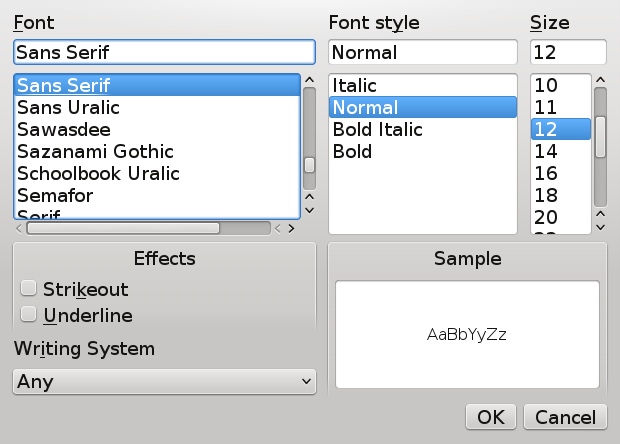

   A font selection

.. _fig-gtkwidgets:
A selection of GTK+ widgets.

.. _fig-gtkwidget-label:

   A text label

.. _fig-gtkwidget-combobox:
.. figure:: figures/gtk-combo-box.png
   :figwidth: 100%
   :width: 30%
   :align: center

   A drop-down selection (combo box)

.. _fig-gtkwidget-button:
.. figure:: figures/gtk-button.png
   :figwidth: 100%
   :width: 15%
   :align: center

   A push button

.. _fig-gtkwidget-checkbox:
.. figure:: figures/gtk-check-button.png
   :figwidth: 100%
   :width: 30%
   :align: center

   A tick box

.. _fig-gtkwidget-menu:

   A menu bar

.. _fig-gtkwidget-entry:
.. figure:: figures/gtk-text-entry.png
   :figwidth: 100%
   :width: 30%
   :align: center

   A text entry field

.. _fig-gtkwidget-fontsel:
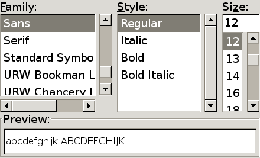

   A font selection

Not all widgets are interactive.  For example, the user cannot usually
interact with a label, or a framebox.  Some widgets, such as
containers, boxes and event boxes are not even visible to the user
(there is more about this in Section \ref{sec:containers}).

Different types of widget have their own unique *properties*.
For example, a label widget contains the text it displays, and there
are functions to get and set the label text.  A checkbox may be ticked
or not, and there are functions to get and set its state.  An options
menu has functions to set the valid options, and get the option the
user has chosen.

Containers
----------

.. _sec-containers:

The top-level of every GTK+ interface is the *window*.  A window
is what one might expect it to be: it has a title bar, borders (which
may allow resizing), and it contains the rest of the interface.

In GTK+, a :c:type:`GtkWindow` *is a* :c:type:`GtkContainer`.  In English,
this means that the window is a widget that can contain another
widget.  More precisely, a :c:type:`GtkContainer` can contain exactly
**one** widget.  This is usually quite confusing compared with
the behaviour of other graphics toolkits, which allow one to place the
controls on some sort of "form".

The fact that a :c:type:`GtkWindow` can only contain one widget
initially seems quite useless.  After all, user interfaces usually
consist of more than a single button.  In GTK+, there are other kinds
of :c:type:`GtkContainer`.  The most commonly used are horizontal boxes,
vertical boxes, and tables.  The structure of these containers is
shown in Figure \ref{fig:containers}.

Figure \ref{fig:containers} shows the containers as having equal size,
but in a real interface, the containers resize themselves to fit the
widgets they contain.  In other cases, widgets may be expanded or
shrunk to fit the space allotted to them.  There are several ways to
control this behaviour, to give fine control over the appearance of
the interface.

.. _fig-containers:

GTK+ containers.  Each container may contain other widgets in the
shaded areas.  Containers may contain more containers, allowing them
to nest.  Complex interfaces may be constructed by nesting the
different types of container.

.. _fig-container-hbox:
.. figure:: figures/container-hbox
   :figwidth: 45%

   Horizontal box: :c:type:`GtkHBox`

.. _fig-container-vbox:
.. figure:: figures/container-vbox
   :figwidth: 45%

   Vertical box: :c:type:`GtkVbox`

.. _fig-container-table:
.. figure:: figures/container-table
   :figwidth: 45%

   Table: :c:type:`GtkTable`

In addition to the containers discussed above, there are more complex
containers available, such are horizontal and vertical panes, tabbed
notebooks, and viewports and scrolled windows.  These are out of the
scope of this tutorial, however.

Newcomers to GTK+ may find the concept of containers quite strange.
Users of Microsoft Visual Basic or Visual C++ may be used to the
free-form placement of controls.  The placement of controls at fixed
positions on a form has *no* advantages over automatic
positioning and sizing.  All decent modern toolkits use automatic
positioning.  This fixes several issues with fixed layouts:

* The hours spent laying out forms, particularly when maintaining
  existing code.
* Windows that are too big for the screen.
* Windows that are too small for the form they contain.
* Issues with spacing when accommodating translated text.
* Bad things happen when changing the font size from the default.

The nesting of containers results in a *widget tree*, which has
many useful properties, some of which will be used later.  One
important advantage is that they can dynamically resize and
accommodate different lengths of text, important for
internationalisation when translations in different languages may vary
widely in their size.

The Glade user interface designer can be very instructive when
exploring how containers and widget packing work.  It allows easy
manipulation of the interface, and all of the standard GTK+ widgets
are available.  Modifying an existing interface is trivial, even when
doing major reworking.  Whole branches of the widget tree may be cut,
copied and pasted at will, and a widget's properties may be
manipulated using the "Properties" dialogue.  While studying the
code examples, Glade may be used to interactively build and manipulate
the interface, to visually follow how the code is working.  More
detail about Glade is provided in Section \ref{sec:glade}, where
:program:`libglade` is used to dynamically load a user interface.

Signals
-------

Most graphical toolkits are *event-driven*, and GTK+ is no
exception.  Traditional console applications tend not to be
event-driven; these programs follow a fixed path of execution.  A
typical program might do something along these lines:

* Prompt the user for some input
* Do some work
* Print the results

This type of program does not give the user any freedom to
do things in a different order.  Each of the above steps might be a
single function (each of which might be split into helper functions,
and so on).

GTK+ applications differ from this model.  The programs must react to
*events*, such as the user clicking on a button, or pressing
Enter in an text entry field.  These widgets emit signals in response
to user actions.  For each signal of interest, a function defined by
the programmer is called.  In these functions, the programmer can do
whatever needed.  For example, in the :program:`ogcalc` program, when
the "Calculate" button is pressed, a function is called to read the
data from entry fields, do some calculations, and then display the
results.

Each event causes a *signal* to be *emitted* from the widget handling
the event.  The signals are sent to *signal handlers*.  A signal
handler is a function which is called when the signal is emitted.  The
signal handler is *connected* to the signal.  In C, these functions
are known as *callbacks*.  The process is illustrated graphically in
Figure \ref{fig:signals}.

.. _fig-signals:
.. figure:: figures/signals
   :figwidth: 60%

   A typical signal handler.  When the button is pressed, a signal is
   emitted, causing the registered callback function to be called.

A signal may have zero, one or many signal handlers connected
(registered) with it.  If there is more than one signal handler, they
are called in the order they were connected in.

Without signals, the user interface would display on the screen, but
would not actually *do* anything.  By associating signal handlers
with signals one is interested in, events triggered by the user
interacting with the widgets will cause things to happen.

Libraries
---------

GTK+ is comprised of several separate libraries:

:program:`atk`
   Accessibility Toolkit, to enable use by disabled people.
:program:`gdk`
   GIMP Drawing Kit (XLib abstraction layer---windowing system dependent part).
:program:`gdk-pixbuf`
   Image loading and display.
:program:`glib`
   Basic datatypes and common algorithms.
:program:`gmodule`
   Dynamic module loader (:program:`libdl` portability wrapper).
:program:`gobject`
   Object/type system.
:program:`gtk`
   GIMP Tool Kit (windowing system independent part).
:program:`pango`
   Type layout and rendering.

When using :program:`libglade` another library is required:

:program:`glade`
   User Interface description loader/constructor.

Lastly, when using C++, some additional C++ libraries are also needed:

:program:`atkmm`
   C++ ATK wrapper.
:program:`gdkmm`
   C++ GDK wrapper.
:program:`gtkmm`
   C++ GTK+ wrapper.
:program:`glademm`
   C++ Glade wrapper.
:program:`pangomm`
   C++ Pango wrapper.
:program:`sigc++`
   Advanced C++ signalling and event handling (wraps GObject signals).

This looks quite intimidating!  However, there is no need to worry,
since compiling and linking programs is quite easy.  Since the
libraries are released together as a set, there are few library
interdependency issues.

Designing an application
========================

Planning ahead
--------------

Before starting to code, it is necessary to plan ahead by thinking
about what the program will do, and how it should do it.  When
designing a graphical interface, one should pay attention to
*how* the user will interact with it, to ensure that it is both
easy to understand and efficient to use.

When designing a GTK+ application, it is useful to sketch the
interface on paper, before constructing it.  Interface designers such
as Glade are helpful here, but a pen and paper are best for the
initial design.

Introducing :program:`ogcalc`
-----------------------------

As part of the production (and quality control) processes in the
brewing industry, it is necessary to determine the alcohol content of
each batch at several stages during the brewing process.  This is
calculated using the density (gravity) in
:math:`\mathrm{g}/\mathrm{cm}^3` and the refractive index.  A
correction factor is used to align the calculated value with that
determined by distillation, which is the standard required by HM
Customs \& Excise.  Because alcoholic beverages are only slightly
denser than water, the PG value is the :math:`(\mathrm{density} -1)
\times 10000`.  That is, 1.0052 would be entered as 52.

Original gravity is the density during fermentation.  As alcohol is
produced during fermentation, the density falls.  Traditionally, this
would be similar to the PG, but with modern high-gravity brewing (at a
higher concentration) it tends to be higher.  It is just as important
that the OG is within the set limits of the specification for the
product as the ABV.

The :program:`ogcalc` program performs the following calculation:

.. math::

   O = (R \times 2.597) - (P \times 1.644) - 34.4165 + C

If O is less than 60, then

.. math::

   A = (O - P) \times 0.130

otherwise

.. math::

   A = (O - P) \times 0.134

The symbols have the following meanings:

:math:`A`
   Percentage Alcohol By Volume
:math:`C`
   Correction Factor
:math:`O`
   Original Gravity
:math:`P`
   Present Gravity
:math:`R`
   Refractive Index

Designing the interface
-----------------------

The program needs to ask the user for the values of :math:`C`,
:math:`P`, and :math:`R`.  It must then display the results, :math:`A`
and :math:`O`.

A simple sketch of the interface is shown in Figure \ref{fig:sketch}.

.. _fig-sketch:
.. figure:: figures/sketch
   :figwidth: 60%

   Sketching a user interface.  The :program:`ogcalc` main window is
   drawn simply, to illustrate its functionality.  The top row
   contains three numeric entry fields, followed by two result fields
   on the middle row.  The bottom row contains buttons to quit the
   program, reset the interface and do the calculation.

Creating the interface
----------------------

Due to the need to build up an interface from the bottom up, due to
the containers being nested, the interface is constructed starting
with the window, then the containers that fit in it.  The widgets the
user will use go in last.  This is illustrated in Figure
\ref{fig:packing}.

Widget packing.  The steps taken during the creation of an interface
are shown, demonstrating the use of nested containers to pack widgets.

.. _qt-fig-packing:
.. _qt-fig-packing-1:
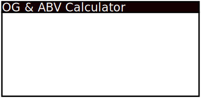

   An empty window

.. _qt-fig-packing-2:
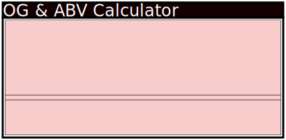

   Addition of a :c:type:`GtkVBox`

.. _qt-fig-packing-3:
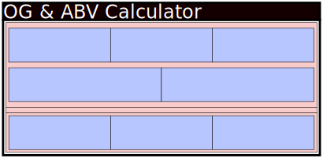

   Addition of three :c:type:`GtkHBox` widgets

.. _qt-fig-packing-4:
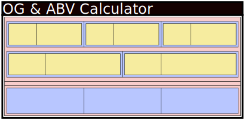

   Addition of five more :c:type:`GtkHBox` widgets, used to ensure
   visually appealing widget placement

.. _qt-fig-packing-final:
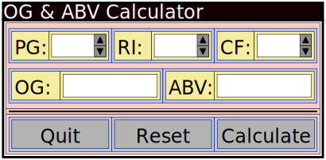

   Addition of all of the user-visible widgets

.. _fig-packing:
.. _fig-packing-1:
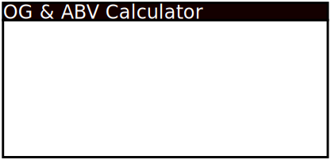

   An empty window

.. _fig-packing-2:
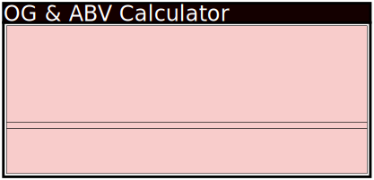

   Addition of a :c:type:`GtkVBox`

.. _fig-packing-3:
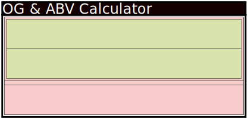

   Addition of a second :c:type:`GtkVBox`; this has uniformly-
   sized children (it is *homogeneous*), unlike the first.

.. _fig-packing-4:
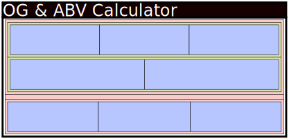

   Addition of three :c:type:`GtkHBox` widgets

.. _fig-packing-5:
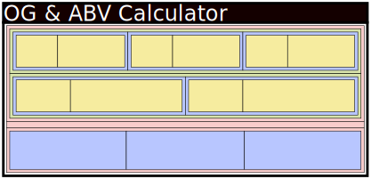

   Addition of five more :c:type:`GtkHBox` widgets, used to ensure
   visually appealing widget placement

.. _fig-packing-6:
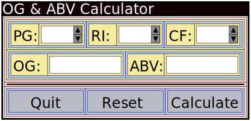

   Addition of all of the user-visible widgets

Once a widget has been created, signal handlers may be connected to
its signals.  After this is completed, the interface can be displayed,
and the main *event loop* may be entered.  The event loop
receives events from the keyboard, mouse and other sources, and causes
the widgets to emit signals.  To end the program, the event loop must
first be left.

GTK+ and C
==========

.. _sec-gtkc:

Introduction
------------

Many GTK+ applications are written in C alone.  This section
demonstrates the :program:`gtk/C/plain/ogcalc` program discussed in the
previous section.  Figure \ref{fig:ogcalc} is a screenshot of the
finished application.

.. _fig-ogcalc:
.. figure:: figures/c-plain.png
   :figwidth: 60%

   :program:`gtk/C/plain/ogcalc` in action

This program consists of five functions:

:c:func:`on_button_clicked_reset`
   Reset the interface to its default state.
:c:func:`on_button_clicked_calculate`
   Get the values the user has entered, do
   a calculation, then display the results.
:c:func:`main`
   Initialise GTK+, construct the interface,
   connect the signal handlers, then enter the GTK+ event loop.
:c:func:`create_spin_entry`
   A helper function to create a
   numeric entry with descriptive label and tooltip, used when
   constructing the interface.
:c:func:`create_result_label`
   A helper function to create a
   result label with discriptive label and tooltip, used when
   constructing the interface.

Code listing
------------

The program code is listed below.  The source code is extensively
commented, to explain what is going on.

:file:`gtk/C/plain/ogcalc.c`

.. literalinclude:: ../gtk/C/plain/ogcalc.c
   :language: c
   :lines: 24-459

To build the source, do the following:

::

   cd gtk/C/plain
   cc $(pkg-config --cflags gtk+-2.0) -c ogcalc.c
   cc $(pkg-config --libs gtk+-2.0) -o ogcalc ogcalc.o

Analysis
--------

The :c:func:`main` function is responsible for constructing the user
interface, connecting the signals to the signal handlers, and then
entering the main event loop.  The more complex aspects of the
function are discussed here.

.. code-block:: c

   g_signal_connect (G_OBJECT(window),
                     "destroy",
                     gtk_main_quit, NULL);

This code connects the "destroy" signal of :c:data:`window` to the
:c:func:`gtk_main_quit` function.  This signal is emitted by the
window when it is to be destroyed, for example when the "close"
button on the titlebar is clicked).  The result is that when the
window is closed, the main event loop returns, and the program then
exits.

.. code-block:: c

   vbox1 = gtk_vbox_new (FALSE, 0);
   gtk_container_add (GTK_CONTAINER(window), vbox1);

:c:data:`vbox1` is a :c:type:`GtkVBox`.  When constructed using
:c:func:`gtk_vbox_new`, it is set to be non-homogeneous
(``FALSE``), which allows the widgets contained within the
:c:type:`GtkVBox` to be of different sizes, and has zero pixels padding
space between the container widgets it will contain.  The homogeneity
and padding space are different for the various :c:type:`GtkBox`es used,
depending on the visual effect intended.

:c:func:`gtk_container_add` packs :c:data:`vbox1` into the window
(a :c:type:`GtkWindow` object *is a* :c:type:`GtkContainer`).

.. code-block:: c

   eventbox = gtk_event_box_new();
   gtk_widget_show(eventbox);
   gtk_box_pack_start (GTK_BOX(hbox2), eventbox,
                       FALSE, FALSE, 0);

Some widgets do not receive events from the windowing system, and
hence cannot emit signals.  Label widgets are one example of this.  If
this is required, for example in order to show a tooltip, they must be
put into a :c:type:`GtkEventBox`, which can receive the events.  The
signals emitted from the :c:type:`GtkEventBox` may then be connected to
the appropriate handler.

:c:func:`gtk_widget_show` displays a widget.  Widgets are hidden by
default when created, and so must be shown before they can be used.
It is typical to show the top-level window *last*, so that the
user does not see the interface being drawn.

:c:func:`gtk_box_pack_start` packs a widget into a :c:type:`GtkBox`,
in a similar manner to :c:func:`gtk_container_add`.  This packs
:c:data:`eventbox` into :c:data:`hbox2`.  The last three arguments
control whether the child widget should expand into an extra space
available, whether it should fill any extra space available (this has
no effect if :c:data:`expand` is ``FALSE``), and extra space in
pixels to put between its neighbours (or the edge of the box),
respectively.  Figure \ref{fig:boxpacking} shows how
:c:func:`gtk_box_pack_start` works.

.. _fig-boxpacking:
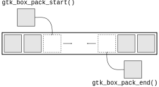

   Packing widgets into a :c:type:`GtkHBox`.

The :c:func:`create_spin_entry` function is a helper function to
create a numeric entry (spin button) together with a label and
tooltip.  It is used to create all three entries.

.. code-block:: c

   label = gtk_label_new(label_text);

A new label is created displaying the text :c:data:`label_text`.

.. code-block:: c

   spinbutton = gtk_spin_button_new (adjustment, 0.5, 2);
   gtk_spin_button_set_numeric
     (GTK_SPIN_BUTTON(spinbutton), TRUE);

A :c:type:`GtkSpinButton` is a numeric entry field.  It has up and down
buttons to "spin" the numeric value up and down.  It is associated
with a :c:type:`GtkAdjustment`, which controls the range allowed,
default value, etc..  :c:func:`gtk_adjustment_new` returns a new
:c:type:`GtkAdjustment` object.  Its arguments are the default value,
minimum value, maximum value, step increment, page increment and page
size, respectively.  This is straightforward, apart from the step and
page increments and sizes.  The step and page increments are the value
that will be added or subtracted when the mouse button 1 or button 2
are clicked on the up or down buttons, respectively.  The page size
has no meaning in this context (:c:type:`GtkAdjustment`s are also used
with scrollbars).

:c:func:`gtk_spin_button_new` creates a new :c:type:`GtkSpinButton`,
and associates it with :c:data:`adjustment`.  The second and third
arguments set the "climb rate" (rate of change when the spin buttons
are pressed) and the number of decimal places to display.

Finally, :c:func:`gtk_spin_button_set_numeric` is used to ensure
that only numbers can be entered.

.. code-block:: c

   tooltip = gtk_tooltips_new();
   gtk_tooltips_set_tip(tooltip, eventbox,
                        tooltip_text, NULL);

A tooltip (pop-up help message) is created with
:c:func:`gtk_tooltips_new`.  :c:func:`gtk_tooltips_set_tip` is
used to associate :c:data:`tooltip` with the :c:data:`eventbox`
widget, also specifying the message it should contain.  The fourth
argument should typically be ``NULL``.

The :c:func:`create_result_label` function is a helper function to
create a result label together with a descriptive label and tooltip.

.. code-block:: c

   gtk_label_set_selectable (GTK_LABEL(result_value), TRUE);

Normally, labels simply display a text string.  The above code allows
the text to be selected and copied, to allow pasting of the text
elsewhere.  This is used for the result fields so the user can easily
copy them.

Continuing with the :c:func:`main` function:

.. code-block:: c

   button1 = gtk_button_new_from_stock(GTK_STOCK_QUIT);

This code creates a new button, using a *stock widget*.  A stock
widget contains a predefined icon and text.  These are available for
commonly used functions, such as "OK", "Cancel", "Print", etc..

.. code-block:: c

   button2 = gtk_button_new_with_mnemonic("_Calculate");
   g_signal_connect (G_OBJECT (button2), "clicked",
                     G_CALLBACK(on_button_clicked_calculate),
                     (gpointer) &cb_widgets);
   GTK_WIDGET_SET_FLAGS (button2, GTK_CAN_DEFAULT);

Here, a button is created, with the label "Calculate".  The
*mnemonic* is the ``_C``, which creates an *accelerator*.  This
means that when Alt-C is pressed, the button is activated (i.e. it is
a keyboard shortcut).  The shortcut is underlined, in common with
other graphical toolkits.

The "clicked" signal (emitted when the button is pressed and
released) is connected to the :c:func:`on_button_clicked_calculate`
callback.  A pointer to the :c:data:`cb_widgets` structure is passed
as the argument to the callback.

Lastly, the ``GTK_CAN_DEFAULT`` attribute is set.  This attribute
allows the button to be the default widget in the window.

.. code-block:: c

   g_signal_connect_swapped
     (G_OBJECT (cb_widgets.pg_val),
      "activate",
      G_CALLBACK (gtk_widget_grab_focus),
      (gpointer)GTK_WIDGET(cb_widgets.ri_val));

This code connects signals in the same way as
:c:func:`gtk_signal_connect`.  The difference is the fourth
argument, which is a :c:type:`GtkWidget` pointer.  This allows the
signal emitted by one widget to be received by the signal handler for
another.  Basically, the :c:data:`widget` argument of the signal
handler is given :c:data:`cb_widgets.ri_val` rather than
:c:data:`cb_widgets.pg_val`.  This allows the focus (where keyboard
input is sent) to be switched to the next entry field when Enter is
pressed in the first.

.. code-block:: c

   g_signal_connect_swapped
     (G_OBJECT (cb_widgets.cf_val),
      "activate",
      G_CALLBACK (gtk_window_activate_default),
      (gpointer) GTK_WIDGET(window));

This is identical to the last example, but in this case the callback
is the function :c:func:`gtk_window_activate_default` and the widget
to give to the signal handler is :c:data:`window`.  When Enter is
pressed in the CF entry field, the default "Calculate" button is
activated.

.. code-block:: c

   gtk_main();

This is the GTK+ event loop.  It runs until :c:func:`gtk_main_quit`
is called.

The signal handlers are far simpler than the interface construction.
The function :c:func:`on_button_clicked_calculate` reads the user
input, performs a calculation, and then displays the result.

.. code-block:: c

   void on_button_clicked_calculate( GtkWidget *widget,
                                     gpointer   data )
   {
     struct calculation_widgets *w;
     w = (struct calculation_widgets *) data;

Recall that a pointer to :c:data:`cb_widgets`, of type :c:type:`struct
calculation_widgets`, was passed to the signal handler, cast to a
:c:type:`gpointer`.  The reverse process is now applied, casting
:c:data:`data` to a pointer of type :c:type:`struct calculation_widgets`.

.. code-block:: c

   gdouble pg;
   pg = gtk_spin_button_get_value
     (GTK_SPIN_BUTTON(w->pg_val));

This code gets the value from the :c:type:`GtkSpinButton`.

.. code-block:: c

   gchar *og_string;
   og_string = g_strdup_printf ("<b>%0.2f</b>", og);
   gtk_label_set_markup (GTK_LABEL(w->og_result),
                         og_string);
   g_free (og_string);

Here the result :c:data:`og` is printed to the string
:c:data:`og_string`.  This is then set as the label text using
:c:func:`gtk_label_set_markup`.  This function sets the label text
using the *Pango Markup Format*, which uses the ``<b>`` and
``</b>`` tags to embolden the text.

.. code-block:: c

   gtk_spin_button_set_value (GTK_SPIN_BUTTON(w->pg_val),
                              0.0);
   gtk_label_set_text (GTK_LABEL(w->og_result), "");

:c:func:`on_button_clicked_reset` resets the input fields to their
default value, and blanks the result fields.

GTK+ and Glade
==============

.. _sec-glade:

Introduction
------------

In the previous section, the user interface was constructed entirely
"by hand".  This might seem to be rather difficult to do, as well as
being messy and time-consuming.  In addition, it also makes for rather
unmaintainable code, since changing the interface, for example to add
a new feature, would be rather hard.  As interfaces become more
complex, constructing them entirely in code becomes less feasible.

The Glade user interface designer is an alternative to this.  Glade
allows one to design an interface visually, selecting the desired
widgets from a palette and placing them on windows, or in containers,
in a similar manner to other interface designers.  Figure
\ref{fig:glade} shows some screenshots of the various components of
Glade.

.. _fig-glade:
The Glade user interface designer.

.. _fig-glade:main:
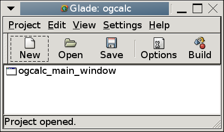

   Main window

.. _fig-glade:palette:
.. figure:: figures/glade-palette.png
   :figwidth: 40%

   Palette for widget selection

.. _fig-glade:properties:
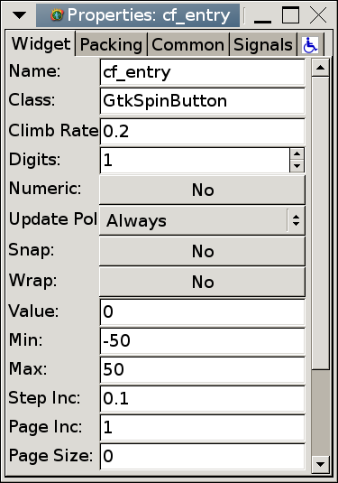

   Widget properties dialogue

.. _fig-glade:tree:
.. figure:: figures/glade-widget-tree.png
   :figwidth: 40%

   Widget tree

.. _fig-glade:ogcalc:
.. figure:: figures/glade-ogcalc.png
   :figwidth: 40%

   The program being designed

The file :file:`gtk/C/glade/ogcalc.glade` contains the same interface
constructed in :program:`gtk/C/plain/ogcalc`, but designed in Glade.  This
file can be opened in Glade, and changed as needed, without needing to
touch any code.

Even signal connection is automated.  Examine the "Signals" tab in
the "Properties" dialogue box.

The source code is listed below.  This is the same as the previous
listing, but with the following changes:

* The :c:func:`main` function does not construct the interface.  It
  merely loads the :file:`ogcalc.glade` interface description,
  auto-connects the signals, and shows the main window.
* The :c:type:`cb_widgets` structure is no longer needed: the callbacks
  are now able to query the widget tree through the Glade XML object
  to locate the widgets they need.  This allows for greater
  encapsulation of data, and signal handler connection is simpler.
* The code saving is significant, and there is now separation between
  the interface and the callbacks.

The running :program:`gtk/C/glade/ogcalc` application is shown in Figure
\ref{fig:ogcalcgl}.  Notice that it is identical to
:program:`gtk/C/plain/ogcalc`, shown in Figure \ref{fig:ogcalc}.  (No, they
are *not* the same screenshot!)

.. _fig-ogcalcgl:
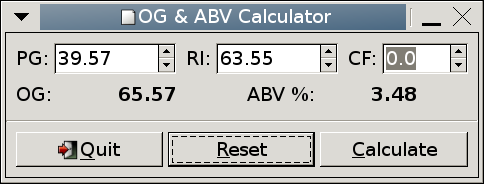

   :program:`gtk/C/glade/ogcalc` in action

Code listing
------------

:file:`gtk/C/glade/ogcalc.c`

.. literalinclude:: ../gtk/C/glade/ogcalc.c
   :language: c
   :lines: 24-142

To build the source, do the following:

::

   cd gtk/C/glade
   cc $(pkg-config --cflags libglade-2.0 gmodule-2.0) -c ogcalc.c
   cc $(pkg-config --libs libglade-2.0 gmodule-2.0)
     -o ogcalc ogcalc.o

Analysis
--------

The most obvious difference between this listing and the previous one
is the huge reduction in size.  The :c:func:`main` function is
reduced to just these lines:

.. code-block:: c

   GladeXML *xml;
   GtkWidget *window;

   xml = glade_xml_new("ogcalc.glade", NULL, NULL);

   glade_xml_signal_autoconnect(xml);

   window = glade_xml_get_widget (xml, "ogcalc_main_window");
   gtk_widget_show(window);

:c:func:`glade_xml_new` reads the interface from the file
:file:`ogcalc.glade`.  It returns the interface as a pointer to a
:c:type:`GladeXML` object, which will be used later.  Next, the signal
handlers are connected with
:c:func:`glade_xml_signal_autoconnect`.  Windows users may require
special linker flags because signal autoconnection requires the
executable to have a dynamic symbol table in order to dynamically find
the required functions.

The signal handlers are identical to those in the previous section.
The only difference is that :c:type:`struct calculation_widgets` has been
removed.  No information needs to be passed to them through the
:c:data:`data` argument, since the widgets they need to use may now
be found using the :c:type:`GladeXML` interface description.

.. code-block:: c

   GtkWidget *pg_val;
   GladeXML *xml;
   xml = glade_get_widget_tree (GTK_WIDGET (widget));
   pg_val = glade_xml_get_widget (xml, "pg_entry");

Firstly, the :c:type:`GladeXML` interface is found, by finding the
widget tree containing the widget passed as the first argument to the
signal handler.  Once :c:data:`xml` has been set,
:c:func:`glade_xml_get_widget` may be used to obtain pointers to
the :c:type:`GtkWidget`s stored in the widget tree.

Compared with the pure C GTK+ application, the code is far simpler,
and the signal handlers no longer need to get their data as structures
cast to :c:type:`gpointer`, which was ugly.  The code is far more
understandable, cleaner and maintainable.

GTK+ and GObject
================

.. _sec-gobject:

Introduction
------------

In the previous sections, the user interface was constructed entirely
by hand, or automatically using libglade.  The callback functions
called in response to signals were simple C functions.  While this
mechanism is simple, understandable and works well, as a project gets
larger the source will become more difficult to understand and manage.
A better way of organising the source is required.

One very common way of reducing this complexity is
*object-orientation*.  The GTK+ library is already made up of
many different objects.  By using the same object mechanism (GObject),
the ogcalc code can be made more understandable and maintainable.

The ogcalc program consists of a :c:type:`GtkWindow` which contains a
number of other :c:type:`GtkWidget`s and some signal handler functions.
If our program was a class (:c:type:`Ogcalc`) which derived from
:c:type:`GtkWindow`, the widgets the window contains would be member
variables and the signal handlers would be member functions (methods).
The user of the class wouldn't be required to have knowledge of these
details, they just create a new :c:type:`Ogcalc` object and show it.

By using objects one also gains *reusability*.  Previously only
one instance of the object at a time was possible, and :c:func:`main`
had explicit knowledge of the creation and workings of the interface.

This example bears many similarities with the C++ Glade example in
Section \ref{sec:cxxglade}.  Some of the features offered by C++ may
be taken advantage of using plain C and GObject.

.. _fig-ogcalcgo:
.. figure:: figures/c-gobject.png
   :figwidth: 60%

   :program:`gtk/C/gobject/ogcalc` in action

Code listing
------------

:file:`gtk/C/gobject/ogcalc.h`

.. literalinclude:: ../gtk/C/gobject/ogcalc.h
   :language: c
   :lines: 27-113

:file:`gtk/C/gobject/ogcalc.c`

.. literalinclude:: ../gtk/C/gobject/ogcalc.c
   :language: c
   :lines: 24-201

:file:`gtk/C/gobject/ogcalc-main.c`

.. literalinclude:: ../gtk/C/gobject/ogcalc-main.c
   :language: c
   :lines: 24-55

To build the source, do the following:

::

   cd gtk/C/gobject
   cc $(pkg-config --cflags libglade-2.0 gmodule-2.0) \
     -c ogcalc.c
   cc $(pkg-config --cflags libglade-2.0 gmodule-2.0) \
     -c ogcalc-main.c
   cc $(pkg-config --libs libglade-2.0 gmodule-2.0) \
     -o ogcalc ogcalc.o ogcalc-main.o

Analysis
--------

The bulk of the code is the same as in previous sections, and so
describing what the code does will not be repeated here.  The
:c:type:`Ogcalc` class is defined in :file:`gtk/C/gobject/ogcalc.h`.
This header declares the object and class structures and some macros
common to all GObject-based objects and classes.  The macros and
internals of GObject are out of the scope of this document, but
suffice it to say that this boilerplate is required, and is identical
for all GObject classes bar the class and object names.

The object structure (:c:type:`_Ogcalc`) has the object it derives from
as the first member.  This is very important, since it allows casting
between types in the inheritance hierarchy, since all of the object
structures start at an offset of 0 from the start address of the
object.  The other members may be in any order.  In this case it
contains the Glade XML interface object and the widgets required to be
manipulated after object and interface construction.  The class
structure (:c:type:`_OgcalcClass`) is identical to that of the derived
class (GtkWindowClass).  For more complex classes, this might contain
virtual function pointers.  It has many similarities to a C++ vtable.
Finally, the header defines the public member functions of the class.

The implementation of this class is found in
:file:`gtk/C/gobject/ogcalc.c`.  The major difference to previous
examples is the class registration and the extra functions for object
construction, initialisation and notification of destruction.  The
body of the methods to reset and calculate are identical to previous
examples.

The macro ``G_DEFINE_TYPE`` is used for convenience.  Its
parameters are the class name to register, the prefix used by methods
of this class and the GType of the parent type we are inheriting from.
It prototypes the initialisation functions defined in the source
below, and it defines the function :c:func:`ogcalc_get_type`, which
is used to get the the typeid (:c:type:`GType`) of the class.  As a side
effect, this function triggers registration of the class with the
GType type system.  GType is a *dynamic* type system.  Unlike
languages like C++, where the types of all classes are known at
compile-time, the majority of all the types used with GTK+ are
registered on demand, except for the primitive data types and the base
class :c:type:`GObject` which are registered as *fundamental* types.  As
a result, in addition to being able to specify constructors and
destructors for the *object* (or *initialisers* and *finalisers* in
GType parlance), it is also possible to have initialisation and
finalisation functions for both the *class* and *base*.  For example,
the class initialiser could be used to fix up the vtable for
overriding virtual functions in derived classes.  In addition, there
is also an :c:data:`instance_init` function, which is used in this
example to initialise the class.  It's similar to the constructor, but
is called after object construction.

All these functions are specified in a :c:type:`GTypeInfo` structure
which is passed to :c:func:`g_type_register_static` to register the
new type.

:c:func:`ogcalc_class_init` is the class initialisation function.
This has no C++ equivalent, since this is taken care of by the
compiler.  In this case it is used to override the :c:func:`finalize`
virtual function in the :c:type:`GObjectClass` base class.  This is used
to specify a virtual destructor (it's not specified in the
:c:type:`GTypeInfo` because the destructor cannot be run until after an
instance is created, and so has no place in object construction).
With C++, the vtable would be fixed up automatically; here, it must be
done manually.  Pure virtual functions and default implementations are
also possible, as with C++.

:c:func:`ogcalc_init` is the object initialisation function
(C++ constructor).  This does a similar job to the :c:func:`main`
function in previous examples, namely contructing the interface (using
Glade) and setting up the few object properties and signal handlers
that could not be done automatically with Glade.  In this example, a
second argument is passed to :c:func:`glade_xml_new`; in this case,
there is no need to create the window, since our :c:type:`Ogcalc` object
*is a* window, and so only the interface rooted from
``ogcalc_main_vbox`` is loaded.

:c:func:`ogcalc_finalize` is the object finalisation function (C++
destructor).  It's used to free resources allocated by the object, in
this case the :c:type:`GladeXML` interface description.
:c:func:`g_object_unref` is used to decrease the reference count on
a :c:type:`GObject`.  When the reference count reaches zero, the object
is destroyed and its destructor is run.  There is also a
:c:func:`dispose` function called prior to :c:func:`finalize`, which
may be called multiple times.  Its purpose is to safely free resources
when there are cyclic references between objects, but this is not
required in this simple case.

An important difference with earlier examples is that instead of
connecting the window "destroy" signal to :c:func:`gtk_main_quit`
to end the application by ending the GTK+ main loop, the "delete"
signal is connected to :c:func:`ogcalc_on_delete_event` instead.
This is because the default action of the "delete" event is to
trigger a "destroy" event.  The object should not be destroyed, so
by handling the "delete" signal and returning ``TRUE``,
destruction is prevented.  Both the "Quit" button and the "delete"
event end up calling :c:func:`gtk_widget_hide` to hide the widget
rather than :c:func:`gtk_main_quit` as before.

Lastly, :file:`gtk/C/gobject/ogcalc-main.c` defines a minimal
:c:func:`main`.  The sole purpose of this function is to create an
instance of :c:type:`Ogcalc`, show it, and then destroy it.  Notice how
simple and understandable this has become now that building the UI is
where it belongs---in the object construction process.  The users of
:c:type:`Ogcalc` need no knowledge of its internal workings, which is
the advantage of encapsulating complexity in classes.

By connecting the "hide" signal of the :c:type:`Ogcalc` object to
:c:func:`gtk_main_quit` the GTK+ event loop is ended when the user
presses "Quit" or closes the window.  By not doing this directly in
the class it is possible to have as many instances of it as ones likes
in the same program, and control over termination is entirely in the
hands of the user of the class---where it should be.

GTK+ and C++
============

.. _sec-cxxglade:

Introduction
------------

In the previous section, it was shown that Glade and GObject could
make programs much simpler, and hence increase their long-term
maintainability.  However, some problems remain:

* Much type checking is done at run-time.  This might mean errors
  only show up when the code is in production use.
* Although object-oriented, using objects in C is a bit clunky.
  In addition, it is very difficult (although not impossible) to
  derive new widgets from existing ones using GObject, or override a
  class method or signal.  Most programmers do not bother, or just use
  "compound widgets", which are just a container containing more
  widgets.
* Signal handlers are not type safe.  This could result in
  undefined behaviour, or a crash, if a signal handler does not have a
  signature compatible with the signal it is connected to.
* Signal handlers are functions, and there is often a need to
  resort to using global variables and casting structures to type
  :c:type:`gpointer` to pass complex information to a callback though its
  :c:data:`data` argument.  If Glade or GObject are used, this can be
  avoided, however.

Gtkmm offers solutions to most of these problems.  Firstly, all of the
GTK+ objects are available as native C++ classes.  The object accessor
functions are now normal C++ *class methods*, which prevents some
of the abuse of objects that could be accomplished in C.  The
advantage is less typing, and there is no need to manually cast
between an object's types to use the methods for different classes in
the inheritance hierarchy.

The Gtkmm classes may be used just like any other C++ class, and this
includes deriving new objects from them through inheritance.  This
also enables all the type checking to be performed by the compiler,
which results in more robust code, since object type checking is not
deferred until run-time.

Signal handling is also more reliable.  Gtkmm uses the
:program:`libsigc++` library, which provides a templated signalling
mechanism for type-safe signal handling.  The :cpp:class:`mem_fun` objects
allow signal handlers with a different signature than the signal
requires to be bound, which gives greater flexibility than the C
signals allow.  Perhaps the most notable feature is that signal
handlers may be class methods, which are recommended over global
functions.  This results in further encapsulation of complexity, and
allows the signal handlers to access the member data of their class.
Unlike the *Qt* library, Gtkmm does not require any source
preprocessing, allowing plain ISO C++ to be used without extensions.

:program:`libglademm` is a C++ wrapper around libglade, and may be used
to dynamically load user interfaces as in the previous section.  It
provides similar functionality, the exception being that signals must
be connected manually.  This is because the :program:`libsigc++`
signals, connecting to the methods of individual objects, cannot be
connected automatically.

:program:`gtk/C++/glade/ogcalc`, shown in Figure \ref{fig:ogcalcmm}, is
identical to the previous examples, both in appearance and
functionality.  However, internally there are some major differences.

.. _fig-ogcalcmm:
.. figure:: figures/c++-glade.png
   :figwidth: 60%

   :program:`gtk/C++/glade/ogcalc` in action

Firstly, the :cpp:func:`main` function no longer knows anything about
the user interface.  It merely instantiates an instance of the
:cpp:class:`ogcalc` class, similarly to :program:`gtk/C/gobject/ogcalc`.

The :cpp:class:`ogcalc` class is derived from the :cpp:class:`Gtk::Window`
class, and so contains all of the functionality of a
:cpp:class:`Gtk::Window`, plus its own additional functions and data.
:cpp:class:`ogcalc` contains methods called
:cpp:func:`on_button_clicked_calculate` and
:cpp:func:`on_button_clicked_reset`.  These are the equivalents of
the functions :c:func:`on_button_clicked_calculate` and
:c:func:`on_button_clicked_reset` used in the previous examples.
Because these functions are class methods, they have access to the
class member data, and as a result are somewhat simpler than
previously.

Two versions are provided, one using the basic C++ classes and methods
to construct the interface, the other using :program:`libglademm` to
load and construct the interface as for the previous examples using
Glade.  Only the latter is discussed here.  There are a great many
similarities between the C and C++ versions not using Glade, and the C
Gobject version and the C++ Glade version.  It is left as an exercise
to the reader to compare and contrast them.

Code Listing
------------

:file:`gtk/C++/glade/ogcalc.h`

.. literalinclude:: ../gtk/C++/glade/ogcalc.h
   :language: c++
   :lines: 27-54

:file:`gtk/C++/glade/ogcalc.cc`

.. literalinclude:: ../gtk/C++/glade/ogcalc.cc
   :language: c++
   :lines: 24-128

:file:`gtk/C++/glade/ogcalc-main.cc`

.. literalinclude:: ../gtk/C++/glade/ogcalc-main.cc
   :language: c++
   :lines: 24-40

To build the source, do the following:

::

   cd gtk/C++/glade
   c++ $(pkg-config --cflags libglademm-2.4) -c ogcalc.cc
   c++ $(pkg-config --cflags libglademm-2.4) -c ogcalc-main.cc
   c++ $(pkg-config --libs libglademm-2.4) -o ogcalc ogcalc.o \
                                             ogcalc-main.o

Similarly, for the plain C++ version, which is not discussed in the
tutorial:

::

   cd gtk/C++/plain
   c++ $(pkg-config --cflags gtkmm-2.4) -c ogcalc.cc
   c++ $(pkg-config --cflags gtkmm-2.4) -c ogcalc-main.cc
   c++ $(pkg-config --libs gtkmm-2.4) -o ogcalc ogcalc.o \
                                               ogcalc-main.o

Analysis
--------

:file:`ogcalc.h`
^^^^^^^^^^^^^^^^^^^

The header file declares the :cpp:class:`ogcalc` class.

.. code-block:: c++

   class ogcalc : public Gtk::Window

:cpp:class:`ogcalc` is derived from :cpp:class:`Gtk::Window`

.. code-block:: c++

   virtual void on_button_clicked_calculate();
   virtual void on_button_clicked_reset();

:cpp:func:`on_button_clicked_calculate` and
:cpp:func:`on_button_clicked_reset` are the signal handling
functions, as previously.  However, they are now class *member
functions*, taking no arguments.

.. code-block:: c++

   Gtk::SpinButton* pg_entry;
   Glib::RefPtr<Gnome::Glade::Xml> xml_interface;

The class data members include pointers to the objects needed by the
callbacks (which can access the class members like normal class member
functions).  Note that :cpp:class:`Gtk::SpinButton` is a native C++ class.
It also includes a pointer to the XML interface description.
:cpp:class:`Glib::RefPtr` is a templated, reference-counted, "smart
pointer" class, which will take care of destroying the pointed-to
object when :cpp:class:`ogcalc` is destroyed.

:file:`ogcalc.cc`
^^^^^^^^^^^^^^^^^^^^

The constructor :cpp:func:`ogcalc::ogcalc` takes care of creating the
interface when the class is instantiated.

.. code-block:: c++

   set_title("OG & ABV Calculator");
   set_resizable(false);

The above code uses member functions of the :cpp:class:`Gtk::Window` class.
The global functions :c:func:`gtk_window_set_title` and
:c:func:`gtk_window_set_resizable` were used previously.

.. code-block:: c++

   set_title("OG & ABV Calculator");
   set_resizable(false);

   xml_interface =
     Gnome::Glade::Xml::create("ogcalc.glade",
                               "ogcalc_main_vbox");
   Gtk::VBox *main_vbox;
   xml_interface->get_widget("ogcalc_main_vbox", main_vbox);
   add(*main_vbox);

The Glade interface is loaded using
:cpp:func:`Gnome::Glade::Xml::create`, in a similar manner to the
GObject example, and then the main VBox is added to the :cpp:class:`Ogcalc`
object.

.. code-block:: c++

   xml_interface->get_widget("pg_entry", pg_entry);

Individual widgets may be obtained from the widget tree using the
static member function :cpp:func:`Gnome::Glade::Xml::get_widget`.

Because Gtkmm uses :program:`libsigc++` for signal handling, which uses
class member functions as signal handlers (normal functions may also
be used, too), the signals cannot be connected automatically, as in
the previous example.

.. code-block:: c++

   quit_button->signal_clicked().connect
     ( sigc::mem_fun(*this, &ogcalc::hide) );

This complex-looking code can be broken into several parts.

.. code-block:: c++

   sigc::mem_fun(*this, &ogcalc::hide)

creates a :cpp:class:`sigc::mem_fun` (function object) which points
to the :cpp:func:`ogcalc::hide` member function of this object.

.. code-block:: c++

   quit_button->signal_clicked()

returns a :cpp:class:`Glib::SignalProxy0` object (a signal taking no
arguments).  The :cpp:func:`connect` method of the signal proxy is used
to connect :cpp:func:`ogcalc::hide` to the "clicked" signal of the
:cpp:class:`Gtk::Button`.

.. code-block:: c++

   calculate_button->signal_clicked().connect
     ( sigc::mem_fun(*this,
                    &ogcalc::on_button_clicked_calculate) );
   calculate_button->signal_clicked().connect
     ( sigc::mem_fun(*reset_button, &Gtk::Widget::grab_focus) );

Here two signal handlers are connected to the same signal.  When the
"Calculate" button is clicked,
:cpp:func:`ogcalc::on_button_clicked_calculate` is called first,
followed by :cpp:func:`Gtk::Widget::grab_focus`.

.. code-block:: c++

   cf_entry->signal_activate().connect
     ( sigc::hide_return
       ( sigc::mem_fun(*this,
                      &Gtk::Window::activate_default) ) );

:cpp:class:`sigc::hide_return` is a special :cpp:class:`sigc::mem_fun` used to
mask the boolean value returned by :cpp:func:`activate_default`.  The
:cpp:class:`mem_fun` created is incompatible with with the
:cpp:class:`mem_fun` type required by the signal, and this "glues" them
together.

In the :cpp:func:`ogcalc::on_button_clicked_calculate` member
function,

.. code-block:: c++

   double pg
   pg = pg_entry->get_value();

the member function :cpp:func:`Gtk::SpinButton::get_value`
was previously used as :cpp:func:`gtk_spin_button_get_value`.

.. code-block:: c++

   std::ostringstream output;
   output.imbue(std::locale(""));
   output << "<b>" << std::fixed << std::setprecision(2)
          << og << "</b>";
   og_result->set_markup(Glib::locale_to_utf8(output.str()));

This code sets the result field text, using an output stringstream and
Pango markup.

In the :cpp:func:`ogcalc::on_button_clicked_reset` member function,

.. code-block:: c++

   pg_entry->set_value(0.0);
   og_result->set_text("");
   pg_entry->grab_focus();

class member functions are used to reset and clear the
widgets as in previous examples.

:file:`ogcalc-main.cc`
^^^^^^^^^^^^^^^^^^^^^^^^^

This file contains a very simple :cpp:func:`main` function.

.. code-block:: c++

   Gtk::Main kit(argc, argv); // Initialise GTK+.
   ogcalc window;
   kit.run(window);

A :cpp:class:`Gtk::Main` object is created, and then an :cpp:class:`ogcalc`
class, :cpp:member:`window`, is instantiated.  Finally, the interface is
run, using ``kit.run()``.  This function will return when
:cpp:member:`window` is hidden, and then the program will exit.

Python
======

.. _sec-python:

Introduction
------------

Python is a popular scripting language, particularly with beginners to
programming, but also used by many veteran developers.  It has a clear
and simple syntax, coupled with decent support for both procedural and
object-oriented programming.  Unlike C and C++, Python is an
interpreted language, and so compilation is not necessary.  This has
some advantages, for example development is faster, particularly when
prototyping new code.  There are also disadvantages, such as programs
running much slower than machine code.  Worse, all code paths must be
run in order to verify they are syntactically correct, and simple
typing mistakes can result in a syntactically correct, but
dysfunctional, program.  A good C or C++ compiler would catch these
errors, but Python cannot.  There are tools, such as
:program:`pychecker`, which help with this.  The purpose of this
document is not to advocate any particular tool, however.  The pros
and cons of each language have been discussed at length in many other
places.

Python has a language binding for GTK+, pyGTK, which allows the
creation of GTK+ user interfaces directly, including the ability to
derive new classes from the standard GTK+ classes, and use Python
functions and object methods as callbacks.  The functionality
provided by :program:`libglade` in C is also similarly available.

In the next section, examples show the use of pyGTK to create the
:program:`ogcalc` interface, using both plain GTK+ and Glade.
The author wrote the Python scripts with only a few hours of Python
experience, directly from the original C source, which demonstrates
just how easy Python is to get into.

Code listing
------------

:file:`gtk/python/plain/ogcalc`

.. literalinclude:: ../gtk/python/plain/ogcalc
   :language: python
   :lines: 26-333

:file:`gtk/python/glade/ogcalc`

.. literalinclude:: ../gtk/python/glade/ogcalc
   :language: python
   :lines: 26-131

Analysis
--------

What the GTK+ classes and methods do here will not be discussed,
having been covered in the previous sections.  Instead, the
Python-specific differences will be examined.

.. code-block:: python

   import pygtk
   pygtk.require('2.0')
   import gtk

This preamble imports the pyGTK modules for us, and checks that the
GTK+ version is correct.

.. code-block:: python

   class OgcalcSpinEntry(gtk.HBox):
       def __init__(self, label_text, tooltip_text,
                    adjustment, digits):
           gtk.HBox.__init__(self, False, 5)
           …

   class OgcalcResult(gtk.HBox):
       def __init__(self, label_text, tooltip_text):
           gtk.HBox.__init__(self, False, 5)
           …

These two simple classes derive from :py:class:`GtkHBox`.  They are the
Python equivalents of the :c:func:`create_spin_entry` and
:c:func:`create_result_label` functions in Section \ref{sec:gtkc}.
They are mostly identical to the C code in terms of the objects
created and the object methods used.  The main difference is that
:c:func:`create_spin_entry` has a :c:data:`spinbutton_pointer`
argument which has been dropped here.  The same difference applies to
:c:func:`create_result_label` for
:c:data:`result_label_pointer`.  In Python, we can't pass pointers
as easily as in C, however we can access the spinbutton as a member of
the :py:class:`OgcalcSpinEntry` object instead (``object.spinbutton``).

Note that because the object is derived, the :py:func:`__init__`
initialiser (constructor) has to manually chain up to the parent
initialiser in order to correctly initialise the class instance.

.. code-block:: python

   class Ogcalc(gtk.Window):

is our main application object.  It derives from
:py:class:`gtk.Window`.

.. code-block:: python

       def on_button_clicked_reset(self, data=None):
           self.pg_entry.spinbutton.set_value(0.0)
           …
           self.abv_result.result_value.set_text("")

This function resets the interface to its initial state.  Note that
all the member variables are accessed through :py:attr:`self`, which
is the class instance, and that the spinbutton and value label to be
manipulated are contained within the helper objects defined above.

.. code-block:: python

       def on_button_clicked_calculate(self, data=None):
           …
           self.og_result.result_value.set_markup \
           ("<b>%(result)0.2f</b>" %{'result': og})

This function does the calculation.  Note the substitution of the
result value into the string, which is rather simpler than both the C
and the C++ code used to construct the result string.

.. code-block:: python

       def __init__(self):
           gtk.Window.__init__(self, gtk.WINDOW_TOPLEVEL)
           self.set_title("OG & ABV Calculator")

This is the initialiser for the :py:class:`Ogcalc` class.  It starts by
chaining up the :py:class:`gtk.Window` initialiser, and then calls the
:py:func:`set_title` :py:class:`gtk.Window` method to set the window
title.

.. code-block:: python

           self.connect("destroy", gtk.main_quit, None)

This connects the "destroy" signal to the :py:func:`gtk.main_quit`
function.  There's far less to type than the C and C++ equivalents,
and hence it's rather more readable.

.. code-block:: python

           self.pg_entry = \
           OgcalcSpinEntry("PG:", "Present Gravity (density)",
                           adjustment, 2)

Here we create a helper object for entering the PG value.

.. code-block:: python

           self.abv_result = \
           OgcalcResult("ABV %:", "Percent Alcohol By Volume")

Here we create a helper object for displaying the ABV result.

.. code-block:: python

           button1 = gtk.Button(None, gtk.STOCK_QUIT, False)
           button1 = gtk.Button("_Reset", None, True)
           button2 = gtk.Button("_Calculate", None, True)

This code creates the buttons.  Unlike C and C++, where different
functions or overloaded constructors were used to create an object
with different parameters, Python only has a single initialiser
function, which is used for both stock and non-stock widgets.
Depending on whether a stock or non-stock widget is being created, the
first and third, or the second arguments are redundant, respectively.

.. code-block:: python

           button1.connect_object("clicked",
               Ogcalc.on_button_clicked_reset, self)

This connects the "clicked" signal to the :py:class:`Ogcalc`
:py:func:`on_button_clicked_reset` method of the :py:attr:`self`
object.

.. code-block:: python

           self.pg_entry.spinbutton.connect_object("activate",
               gtk.Widget.grab_focus, self.ri_entry.spinbutton)

This connects the "activate" signal to the :py:class:`Ogcalc`
:py:func:`grab_focus` method of the
:py:attr:`self.ri_entry.spinbutton` object.

.. code-block:: python

   if __name__ == "__main__":
       ogcalc = Ogcalc()
       ogcalc.show()
       gtk.main()

The classes are intended for use as a module in a larger program.
When run as a standalone script from the command-line, we "run" the
class by creating an instance of it, showing it, and then run the GTK+
main loop.

The Glade code is identical, except for loading the Glade interface:

.. code-block:: python

           self.xml = gtk.glade.XML("ogcalc.glade",
                                    "ogcalc_main_vbox", None);

Here the Glade interface is loaded, rooted at the
``ogcalc_main_vbox`` widget,

.. code-block:: python

           self.pg_val = self.xml.get_widget("pg_entry");

and now a specific widget is pulled out of the XML interface
description.

Conclusion
==========

Which method of programming one chooses is dependent on many different
factors, such as:

* The languages one is familiar with.
* The size and nature of the program to be written.
* The need for long-term maintainability.
* The need for code reuse.

For simple programs, such as :program:`gtk/C/plain/ogcalc`, there is no
problem with writing in plain C, but as programs become more complex,
Glade can greatly ease the effort needed to develop and maintain the
code.  The code reduction and de-uglification achieved through
conversion to Glade/:program:`libglade` is beneficial even for small
programs, however, so I would recommend that Glade be used for all but
the most trivial code.

The C++ code using Gtkmm is slightly more complex than the code using
Glade.  However, the benefits of type and signal safety, encapsulation
of complexity and the ability to re-use code through the derivation of
new widgets make Gtkmm and :program:`libglademm` an even better choice.
Although it is possible to write perfectly good code in C, Gtkmm gives
the programmer security through compiler type checking that plain GTK+
cannot offer.  In addition, improved code organisation is possible,
because inheritance allows encapsulation.

GObject provides similar facilities to C++ in terms of providing
classes, objects, inheritance, constructors and destructors etc., and
is certainly very capable (it is, after all, the basis of the whole of
GTK+!).  The code using GObject is very similar to the corresponding
C++ code in terms of its structure.  However, C++ still provides
facilities such as RAII (Resource Acquisition is Initialisation) and
automatic destruction when an object goes out of scope that C cannot
provide.

Depending on whether the speed and safety tradeoffs are acceptable,
Python may also be a valid choice.  While Python code is certainly
clearer and simpler, the speed of execution and lack of compile-time
type checking are a concern.

There is no "best solution" for all use cases.  Choose based on your
own requirements, preferences and capabilities.  In addition, Glade is
not the solution for every problem.  The author typically uses a
mixture of custom widgets and Glade interfaces (and your custom
widgets can *contain* Glade interfaces!).  Really dynamic interfaces
must be coded by hand, since Glade interfaces are not sufficiently
flexible.  Use what is best for each situation.

Further Reading
===============

The GTK+ Tutorial, and the GTK+ documentation are highly recommended.
These are available from `gtk.org <http://www.gtk.org/>`_.  The Gtkmm
documentation is available from `gtkmm.org <http://www.gtkmm.org>`_.
Unfortunately, some parts of these manuals are as yet incomplete.  I
hope that they will be fully documented in the future, since without
good documentation, it will not be possible to write programs that
take advantage of all the capabilities of GTK+ and Gtkmm, without
having to read the original source code.  While there is nothing wrong
with reading the source, having good documentation is essential for
widespread adoption of GTK+.

Documentation and examples of GObject are scarce, but Mathieu Lacage
has wrote an excellent tutorial.  This is unfortunately no longer
available, but parts of it were merged with the main API documentation
at `developer.gnome.org/gobject/stable
<https://developer.gnome.org/gobject/stable/>`_.

Indices and tables
==================

* :ref:`genindex`
* :ref:`modindex`
* :ref:`search`

