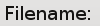
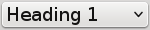
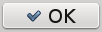
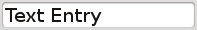
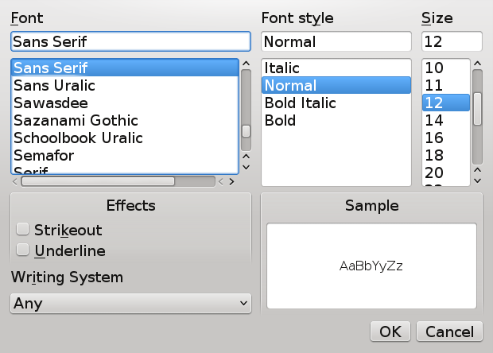
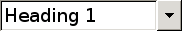
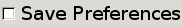
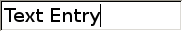
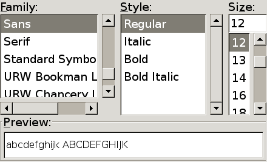

GUI basics
==========

Widgets
-------

A user interface consists of different objects with which the user can
interact.  These include buttons which can be pushed, text entry
fields, tick boxes, labels and more complex things such as menus,
lists, multiple selections, colour and font pickers.  Some example
Qt and GTK+ widgets are shown below.

.. _fig-qtwidgets:

A selection of Qt widgets.

.. _fig-qtwidget-label:

   A text label

.. _fig-qtwidget-combobox:

   A drop-down selection (combo box)

.. _fig-qtwidget-button:

   A push button

.. _fig-qtwidget-checkbox:

   A tick box

.. _fig-qtwidget-menu:

   A menu bar

.. _fig-qtwidget-entry:

   A text entry field

.. _fig-qtwidget-fontsel:

   A font selection

.. _fig-gtkwidgets:

A selection of GTK+ widgets.

.. _fig-gtkwidget-label:

   A text label

.. _fig-gtkwidget-combobox:

   A drop-down selection (combo box)

.. _fig-gtkwidget-button:

   A push button

.. _fig-gtkwidget-checkbox:

   A tick box

.. _fig-gtkwidget-menu:

   A menu bar

.. _fig-gtkwidget-entry:

   A text entry field

.. _fig-gtkwidget-fontsel:

   A font selection

Not all widgets are interactive.  For example, the user cannot usually
interact with a label, or a framebox.  Some widgets, such as
containers, boxes and event boxes are not even visible to the user
(there is more about this in :ref:`sec-containers`).

Different types of widget have their own unique *properties*.
For example, a label widget contains the text it displays, and there
are functions to get and set the label text.  A checkbox may be ticked
or not, and there are functions to get and set its state.  An options
menu has functions to set the valid options, and get the option the
user has chosen.

.. _sec-containers:

Containers
----------

The top-level of every GTK+ interface is the *window*.  A window
is what one might expect it to be: it has a title bar, borders (which
may allow resizing), and it contains the rest of the interface.

In GTK+, a :c:type:`GtkWindow` *is a* :c:type:`GtkContainer`.  In English,
this means that the window is a widget that can contain another
widget.  More precisely, a :c:type:`GtkContainer` can contain exactly
**one** widget.  This is usually quite confusing compared with
the behaviour of other graphics toolkits, which allow one to place the
controls on some sort of "form".

The fact that a :c:type:`GtkWindow` can only contain one widget
initially seems quite useless.  After all, user interfaces usually
consist of more than a single button.  In GTK+, there are other kinds
of :c:type:`GtkContainer`.  The most commonly used are horizontal boxes,
vertical boxes, and tables.  The structure of these containers is
shown in the Figure :ref:`Basic containers <fig-containers>`.

The Figure :ref:`Basic containers <fig-containers>` shows the
containers as having equal size, but in a real interface, the
containers resize themselves to fit the widgets they contain.  In
other cases, widgets may be expanded or shrunk to fit the space
allotted to them.  There are several ways to control this behaviour,
to give fine control over the appearance of the interface.

.. _fig-containers:
.. figure:: figures/containers.*
   :figwidth: 100%
   :width: 60%
   :align: center

   Basic containers.  Here are shown a horizontal box
   (:cpp:class:`QHBoxLayout` or :c:type:`GtkHBox`), vertical box
   (:cpp:class:`QVBoxLayout` or :c:type:`GtkVbox`) and table
   (:cpp:class:`QGridLayout` or :c:type:`GtkTable`).  Each container
   may contain other widgets in the shaded areas.  Containers may
   contain more containers, allowing them to nest.  Complex interfaces
   may be constructed by nesting the different types of container.

In addition to the containers discussed above, there are more complex
containers available, such are horizontal and vertical panes, tabbed
notebooks, and viewports and scrolled windows.  These are out of the
scope of this tutorial, however.

Newcomers to GTK+ may find the concept of containers quite strange.
Users of Microsoft Visual Basic or Visual C++ may be used to the
free-form placement of controls.  The placement of controls at fixed
positions on a form has *no* advantages over automatic
positioning and sizing.  All decent modern toolkits use automatic
positioning.  This fixes several issues with fixed layouts:

* The hours spent laying out forms, particularly when maintaining
  existing code.
* Windows that are too big for the screen.
* Windows that are too small for the form they contain.
* Issues with spacing when accommodating translated text.
* Bad things happen when changing the font size from the default.

The nesting of containers results in a *widget tree*, which has
many useful properties, some of which will be used later.  One
important advantage is that they can dynamically resize and
accommodate different lengths of text, important for
internationalisation when translations in different languages may vary
widely in their size.

The Glade user interface designer can be very instructive when
exploring how containers and widget packing work.  It allows easy
manipulation of the interface, and all of the standard GTK+ widgets
are available.  Modifying an existing interface is trivial, even when
doing major reworking.  Whole branches of the widget tree may be cut,
copied and pasted at will, and a widget's properties may be
manipulated using the "Properties" dialogue.  While studying the
code examples, Glade may be used to interactively build and manipulate
the interface, to visually follow how the code is working.  More
detail about Glade is provided in Section :ref:`sec-glade`, where
:program:`libglade` is used to dynamically load a user interface.

Signals
-------

Most graphical toolkits are *event-driven*, and GTK+ is no
exception.  Traditional console applications tend not to be
event-driven; these programs follow a fixed path of execution.  A
typical program might do something along these lines:

* Prompt the user for some input
* Do some work
* Print the results

This type of program does not give the user any freedom to
do things in a different order.  Each of the above steps might be a
single function (each of which might be split into helper functions,
and so on).

GTK+ applications differ from this model.  The programs must react to
*events*, such as the user clicking on a button, or pressing
Enter in an text entry field.  These widgets emit signals in response
to user actions.  For each signal of interest, a function defined by
the programmer is called.  In these functions, the programmer can do
whatever needed.  For example, in the :program:`ogcalc` program, when
the "Calculate" button is pressed, a function is called to read the
data from entry fields, do some calculations, and then display the
results.

Each event causes a *signal* to be *emitted* from the widget handling
the event.  The signals are sent to *signal handlers*.  A signal
handler is a function which is called when the signal is emitted.  The
signal handler is *connected* to the signal.  In C, these functions
are known as *callbacks*.  The process is illustrated graphically in
Figure :ref:`A typical signal handler <fig-signals>`.

.. _fig-signals:
.. figure:: figures/signals.*
   :figwidth: 60%
   :width: 80%
   :align: center

   A typical signal handler.  When the button is pressed, a signal is
   emitted, causing the registered callback function to be called.

A signal may have zero, one or many signal handlers connected
(registered) with it.  If there is more than one signal handler, they
are called in the order they were connected in.

Without signals, the user interface would display on the screen, but
would not actually *do* anything.  By associating signal handlers
with signals one is interested in, events triggered by the user
interacting with the widgets will cause things to happen.
