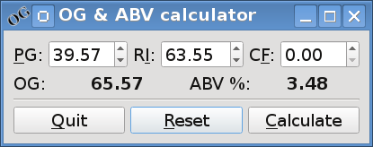

Qt and C++
==========

Introduction
------------

.. Move to Qt overall chapter.

In this chapter, we will look at the several different ways which Qt
applications may be written with C++.  We'll also look at different
ways of building a Qt application so that you can integrate Qt code
with existing build systems.

To start with, we will create an application which uses only C++, and
does everything directly in C++ code.  While simpler approaches exist,
which will be covered in later parts, this will demonstrate use of a
number of useful Qt features.

Figure :ref:`fig-ogcalc-qt-plain-x11` is a screenshot of the
finished application.

.. _fig-ogcalc-qt-plain-x11:

   :program:`qt/plain/am/ogcalc` in action on GNU/Linux

Code listing
------------

The program code is listed below.  The source code is extensively
commented, to explain what is going on.

* :download:`qt/plain/am/SpinBoxEntry.h <../qt/plain/am/SpinBoxEntry.h>`
* :download:`qt/plain/am/SpinBoxEntry.cpp <../qt/plain/am/SpinBoxEntry.cpp>`
* :download:`qt/plain/am/ogcalc.h <../qt/plain/am/ogcalc.h>`
* :download:`qt/plain/am/ogcalc.cpp <../qt/plain/am/ogcalc.cpp>`
* :download:`qt/plain/am/main.cpp <../qt/plain/am/main.cpp>`

Building
--------

To build the source entirely by hand, we first start by running
:program:`moc` to generate some extra sources for the signals and slots:

::

   moc ogcalc.h > moc_ogcalc.cpp
   moc SpinBoxEntry.h > moc_SpinBoxEntry.cpp

Now the sources can be compiled and linked:

::

   g++ $(pkg-config --cflags Qt5Core Qt5Gui Qt5Widgets) -fPIC -c SpinBoxEntry.cpp
   g++ $(pkg-config --cflags Qt5Core Qt5Gui Qt5Widgets) -fPIC -c moc_SpinBoxEntry.cpp
   g++ $(pkg-config --cflags Qt5Core Qt5Gui Qt5Widgets) -fPIC -c ogcalc.cpp
   g++ $(pkg-config --cflags Qt5Core Qt5Gui Qt5Widgets) -fPIC -c moc_ogcalc.cpp
   g++ $(pkg-config --cflags Qt5Core Qt5Gui Qt5Widgets) -fPIC -c main.cpp
   g++ $(pkg-config --libs Qt5Core Qt5Gui Qt5Widgets) -o ogcalc \
     SpinBoxEntry.o moc_SpinBoxEntry.o ogcalc.o moc_ogcalc.o main.o

Or more concisely:

::

   g++ $(pkg-config --cflags --libs Qt5Core Qt5Gui Qt5Widgets) \
     -fPIC -o ogalc ogcalc.cpp moc_ogcalc.cpp SpinBoxEntry.cpp \
     moc_SpinBoxEntry.cpp main.cpp

.. TODO section ref.

We'll look at a number of ways of building the sources in a later section.

Analysis
--------

SpinBoxEntry
^^^^^^^^^^^^

Qt provides a :cpp:class:`QDoubleSpinBox` class which allows the entry
of numbers, storing them as double-precision floating point.  This
class could be used directly, but it does not support emitting a
signal when the Enter key is pressed.  One method for adding such
support is to subclass the widget and add the extended functionality
in the derived class.

From :file:`SpinBoxEntry.h`:

.. code-block:: c++

   class SpinBoxEntry : public QDoubleSpinBox
   {
       Q_OBJECT
   public:
       explicit SpinBoxEntry(QWidget *parent = 0);

   protected:
       void
       keyPressEvent(QKeyEvent *event);

   signals:
       void
       enterPressed();
   };

This starts off looking like standard C++.  The class
:cpp:class:`SpinBoxEntry` is inherited publically from
:cpp:class:`QDoubleSpinBox`.  There's then a non-standard ``Q_OBJECT``
macro as the first part of the body.  If you really want to know what
this bit of magic does, see :file:`<QtCore/qobjectdefs.h>`; it's
basially boilerplate adding some extra members and methods needed by
all Qt widgets in order to support signals, slots and properties.  You
can ignore it; it just needs to be present.

The next part is entirely standard, declaring a public constructor and
overriding a protected method called :cpp:method:`keyPressEvent`.
Overriding this method is how we're going to handle the Enter key.

Lastly, we have non-standard ``signals`` section.  This is similar in
style to ``public``, ``protected`` and ``private`` but is not standard
C++.  In this section we declare an :cpp:method:`enterPressed` method.
Due to its presence in this section, this method is a "signal".  When
we run the :program:`moc` tool, it's looking at these special sections
and generating some extra support code to handle the additional
functionality.

In :file:`SpinBoxEntry.cpp`, we define the methods we declared above:

.. code-block:: c++

   SpinBoxEntry::SpinBoxEntry(QWidget *parent) :
       QDoubleSpinBox(parent)
   {
   }

Firstly, and entirely standard constructor.  All QWidgets require the
parent containing them to be passed in the constructor.  Here, we
simply pass it to our parent class and let it deal with it.

.. code-block:: c++

   void
   SpinBoxEntry::keyPressEvent(QKeyEvent *event)
   {
       switch(event->key())
       {
       case Qt::Key_Enter:
       case Qt::Key_Return:
           emit enterPressed();
           break;
       default:
           QDoubleSpinBox::keyPressEvent(event);
       }
   }

The :cpp:method:`keyPressEvent` is conceptually very simple.  Whenever
a keypress occurs in the entry box, this method is called.  If the
Enter or Return key is pressed, we emit the enterPressed() signal.
Otherwise, we delegate handling of the keypress to our parent; if we
didn't then you wouldn't be able to enter anything since we would
ignore the keypress.  The ``emit`` keyword is also non-standard (it
actualy does nothing, it's just syntactic sugar).

One thing worth noting here is that while we declared the
:cpp:method:`enterPressed` method in the header, we don't define it in
the source file.  This is part of the code generated by :program:`moc`
automatically.  If you look at the generated
:file:`moc_SpinBoxEntry.cpp` file, you can find it there.

ogcalc
^^^^^^

.. code-block:: c++

   class ogcalc : public QMainWindow
   {
     Q_OBJECT;
    public:
     explicit ogcalc (QWidget *parent = 0);
     ~ogcalc ();

    public slots:
     void calculate ();
     void reset ();

    private:
     void setupUi ();
     void retranslateUi ();

     SpinBoxEntry *pg_entry;
     SpinBoxEntry *ri_entry;
     SpinBoxEntry *cf_entry;
     QLabel       *og_result;
     QLabel       *abv_result;
   };

